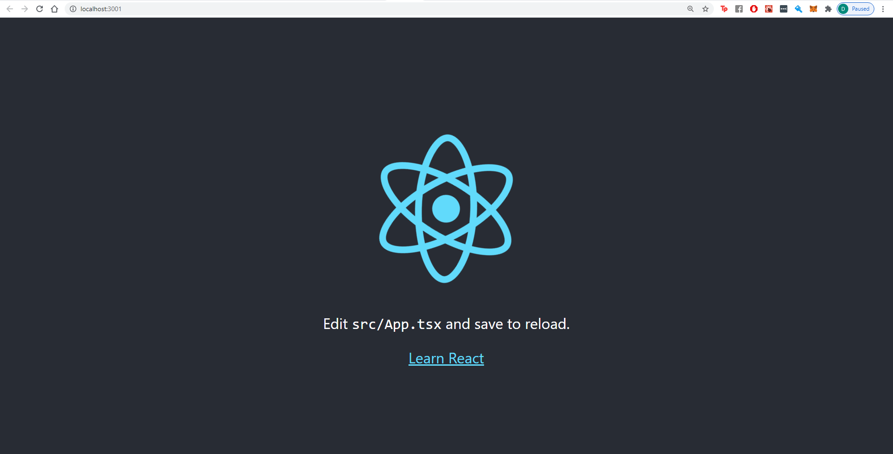

# Create React App with Typescript

## Creating a base react application

Let's create a base template for your react w/ typescript application.

In your terminal run the command:

If you are running npm:

`npx create-react-app {app-name} --template typescript `

If you are running yarn:

`yarn create react-app {app-name} --template typescript `

--template typescript tells create react app to use the typescript template for the react project.

Navigate into your root directory for your app and run the react-app locally

`cd {app-name}`

`npm run start`

This runs the start script specified in our package.json, and will spawn off a server which reloads the page as we save our files. Typically the server runs at http://localhost:3000, but should be automatically opened for you.

Every time you save a change to your application it should be automatically rebuilt. This helps us by allowing us to quickly see changes and therefore iterate on a more frequent basis.

Lets move onto making some components using Material UI!

## Summary

In this part, we've created our base react application, lets go ahead and add some components using a UI library!

[**<< Part #3 - Material UI Integration >>**](3-material-ui-integration.md)
