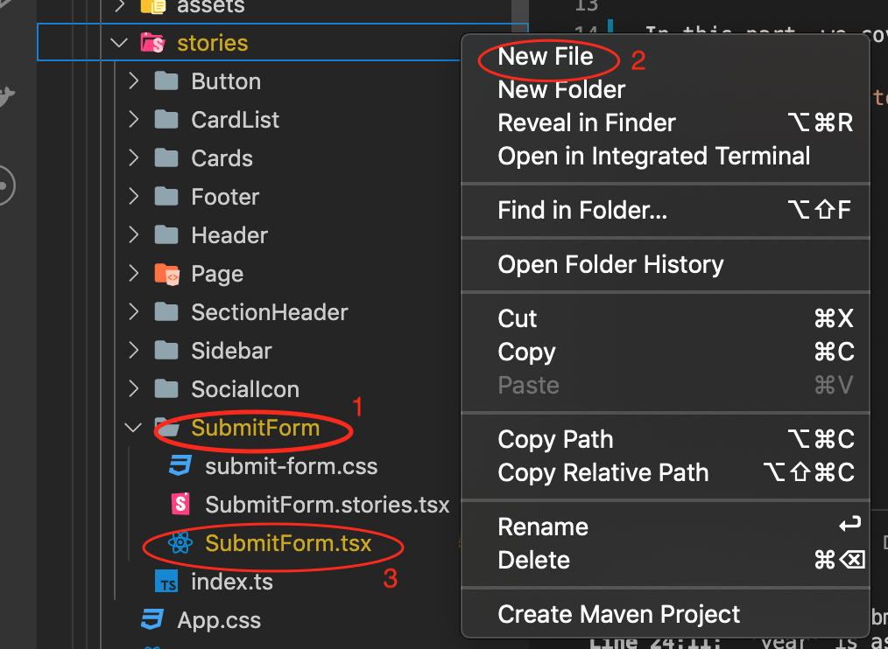
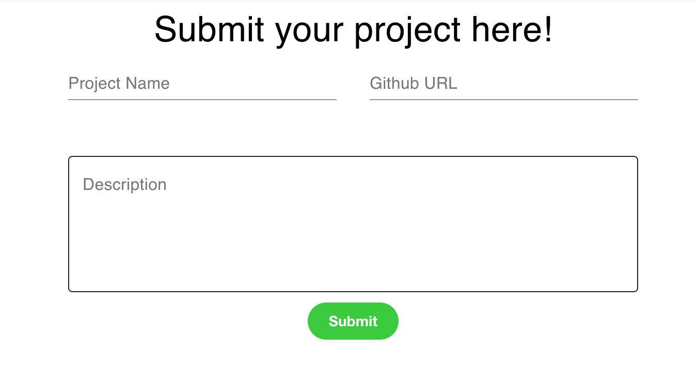
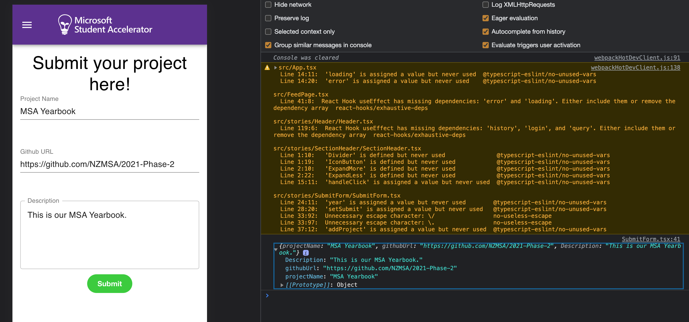

# Create React App with Typescript

## Creating a base react application

Let's create a base template for your react w/ typescript application.

In your terminal run the command:

If you are running npm:

`npx create-react-app {app-name} --template typescript `

If you are running yarn:

`yarn create react-app {app-name} --template typescript `

--template typescript tells create react app to use the typescript template for the react project.

Navigate into your root directory for your app and run the react-app locally

`cd {app-name}`

`npm run start`

This runs the start script specified in our package.json, and will spawn off a server which reloads the page as we save our files. Typically the server runs at http://localhost:3000, but should be automatically opened for you.


Every time you save a change to your application it should be automatically rebuilt. This helps us by allowing us to quickly see changes and therefore iterate on a more frequent basis.

Lets move onto making some components using Material UI!

### Submit Form Component

Now we can write the code for Submit Form.

1. We add a new Folder called `SubmitForm` in `stories` folder, then create a new file, name it `SubmitForm.tsx`.
    

2. Edit the `SubmitForm.tsx` file, we can write a skeleton for `SubmitForm` component, like the following:
    ```typescript
    import React, { useState } from 'react';

    export interface SubmitFormProps {

    }

    export const SubmitForm: React.FC<SubmitFormProps> = () => {
        
    };
    ```

3. Then we filled in with the elements we need for submit form, here we are gonna use the `Material UI` library. For example,
we use `Grid` `Container` to format the form, `TextField` as the Input element. In this stage, we will also style the elements for a better look.

As we have to keep and pass on the user input, `useState` is used and triggered by input `onChange` handler.

```typescript
import React, { useState } from 'react';
import { TextField, Typography, Grid, Container } from '@material-ui/core';
import { makeStyles, Theme } from "@material-ui/core/styles";
import { Button } from '../Button/Button';

import './submit-form.css';

const useStyles = makeStyles((theme: Theme) => ({
    root: {
      "& .MuiFormHelperText-root": {
        color: "white",
      }
    }
  }));
export interface SubmitFormProps {

}

export const SubmitForm: React.FC<SubmitFormProps> = () => {
    const classes = useStyles();
    const year = "YEAR_2021";
    const [projectName, setProjectName] = useState<string>("");
    const [githubUrl, setGithubUrl] = useState<string>("");
    const [description, setDescription] = useState("");
    const [submit, setSubmit] = useState(false);

    const [hasFocus, setHasFocus] = useState(false);
    const handleSubmit = async() => {

    };

    return (
        <Container className="form_container">
            <Typography variant="h4" >Submit your project here!</Typography>
            {
                submit ?
                    <Grid>
                        Congratulations! Your project has been submitted successfully.
                    </Grid> : null
            }
            <Grid container spacing={4}>
                <Grid item xs={12} sm={6}>
                    <TextField id="standard-basic" label="Project Name" fullWidth
                        error={hasFocus && projectName === ""}
                        value={projectName}
                        className={hasFocus && projectName === ""?"":classes.root}
                        helperText="Invalid Project Name"
                        onChange={e => setProjectName(e.target.value)} />
                </Grid>
                <Grid item xs={12} sm={6}>
                    <TextField id="standard-basic" label="Github URL" fullWidth
                        error={hasFocus && (githubUrl === "" || !isGithubUrl(githubUrl))}
                        value={githubUrl}
                        onChange={e => setGithubUrl(e.target.value)}
                        className={hasFocus && (githubUrl === "" || !isGithubUrl(githubUrl))?"":classes.root}
                        helperText="Invalid URL" />
                </Grid>
                <Grid item xs={12} sm={12}>
                    <TextField
                        id="outlined-multiline-static"
                        label="Description"
                        multiline
                        rows={5}
                        placeholder="Introduce your project..."
                        variant="outlined"
                        fullWidth
                        value={description}
                        onChange={e => setDescription(e.target.value)}
                    />
                </Grid>
                
            </Grid>
            <Button className="form_button" backgroundColor="limegreen" label="Submit" onClick={handleSubmit} primary size="medium" />
        </Container>
    );
};
```

If we import this `SubmitForm` component and use it in `App.tsx`, we can view our submit form by starting the app.



4.Add a url check function. At this step, we can use [regular expression](https://developer.mozilla.org/en-US/docs/Web/JavaScript/Guide/Regular_Expressions) to help with checking if the input url is a valid Github link.

> Here is a website [RegExr: Learn, Build, & Test RegEx](https://regexr.com/) you can check if your regular expression working properly.

The validation check code for Github URL can be like this:
```typescript
    const isGithubUrl = (value: string) => {
        const urlRegex = /^(http[s]{0,1}:\/\/){0,1}(github.com\/)([a-zA-Z0-9\-~!@#$%^&*+?:_\/=<>\.]*)?$/i;
        return urlRegex.test(value);
    }
```

Also modify the handleSubmit function to have a test.
```
const handleSubmit = async() => {
    if (projectName !== "" && isGithubUrl(githubUrl)) {
        console.log({"projectName": projectName, "githubUrl": githubUrl, "Description": description });
    }else{
        setHasFocus(true);
    }
};
```

We can change the browser to **Inspect** mode, and give it a go with the **Submit**, then you can see `Console` would
log out the input you made.


## Summary

In this part, we've created our base react application, lets go ahead and add some components using a UI library!

[**<< Part #3 - Material UI Integration >>**](3-material-ui-integration.md)
