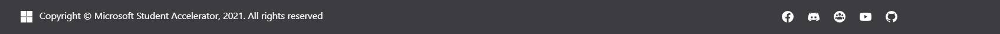
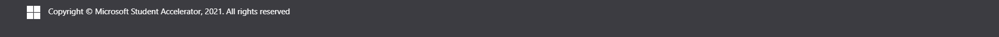
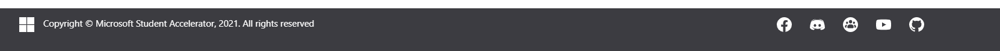
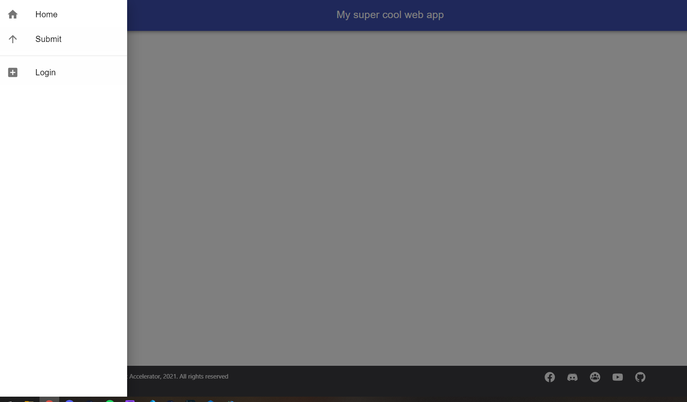
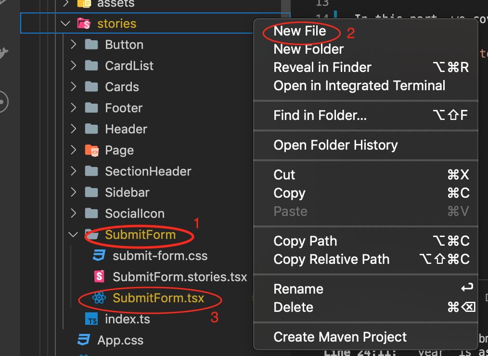
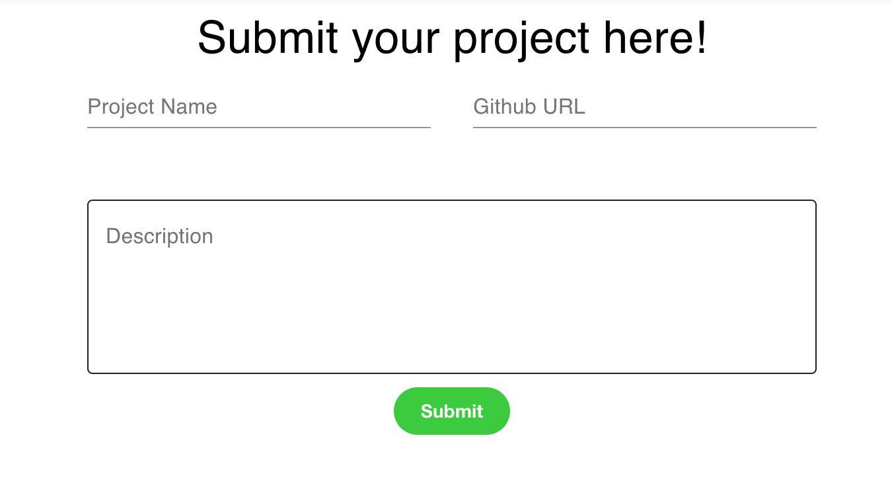
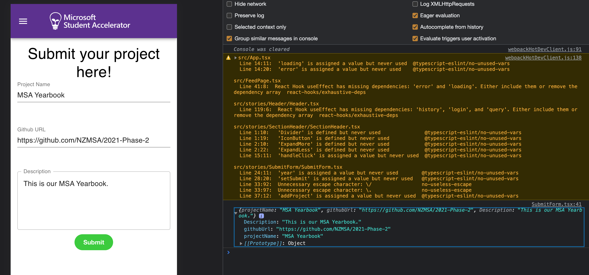

# Material UI

[Official Docs](https://material-ui.com/)

## Installing

As per the documentation run the following command:

`npm install @material-ui/core`

From the official docs, the usage is _very basic_ we are able to import pre-built components from the material-ui component library. Lets test this out, try and remove the code in `App.tsx`
and replace it with the following:

```typescript
import React from "react";
import { Button } from "@material-ui/core";
import "./App.css";

function App() {
  return (
    <div className="App">
      <Button color="primary">HELLO WORLD</Button>
    </div>
  );
}

export default App;
```

You should see a button rendered on the page with Hello World.

**Congrats!** you can now explore and use / import a whole array of components from Material UI and leverage pre-built components to make development that much faster!

## Header Component

Lets build something a little more complex, lets build out a simple Header Component.

Create a new folder under `src` called `Components` and create a folder named `Header` with a **Component** named Header.tsx

Lets start with a simple basic Header function, refer to [App Bar](https://material-ui.com/api/app-bar/) on Material UI for documentation.

You will need to run ` npm install @material-ui/icons` to install and use material ui icons. Read more about icons [here](https://material-ui.com/components/material-icons/)

`Header.tsx`

```typescript
import React from "react";
import MenuIcon from "@material-ui/icons/Menu";
import { AppBar, IconButton, Toolbar } from "@material-ui/core";
import { Button, Typography } from "@material-ui/core";

export default function Header() {
  return (
    <div>
      <AppBar position="static">
        <Toolbar>
          <IconButton edge="start" color="inherit" aria-label="menu">
            <MenuIcon />
          </IconButton>
          <Typography variant="h6">News</Typography>
          <Button color="inherit">Login</Button>
        </Toolbar>
      </AppBar>
    </div>
  );
}
```

Rendering this component in `App.tsx` you should a simple header, with two buttons (Hamburger / Menu button and a LOGIN button)


## useStyle styling (Material UI)

Lets add some styling. We can make use of the makeStyles hook generator that Material UI provide to create styling within the component. We are able to also leverage a global "Theme" styling and are able to over-write it. This is beyond the scope of the workshop but feel free to have a look at the [advanced section](https://material-ui.com/styles/advanced/) of the Material UI documentation for more details.

Lets create some simple styling, a root class, a menuButton class and a title class. Notice how when we utilise these classes , it is very similar to how we utilize CSS by the usage of `className`.

Add the following outside of the component

```typescript
const useStyles = makeStyles((theme: Theme) =>
  createStyles({
    root: {
      flexGrow: 1,
    },
    menuButton: {
      marginRight: theme.spacing(2),
    },
    title: {
      flexGrow: 1,
    },
  })
);
```

Then call the function useStyles within the functional component, and populate the classNames of the components we want to associate with the styling.

```typescript
export default function Header() {
  const classes = useStyles();

  return (
    <div className={classes.root}>
      <AppBar position="static">
        <Toolbar>
          <IconButton
            className={classes.menuButton}
            edge="start"
            color="inherit"
            aria-label="menu"
          >
            <MenuIcon />
          </IconButton>
          <Typography className={classes.title} variant="h6">
            My super cool web app
          </Typography>
          <Button color="inherit">Login</Button>
        </Toolbar>
      </AppBar>
    </div>
  );
}
```

Now we should see some nice spacing between the buttons and the title.


## Footer Component

Now we'll move onto coding a simple Footer component, this is the final product we will look to achieve:



We can break down the above to our footer and smaller `SocialIcon` components.

Lets start with `SocialIcon.tsx`

We'll create some props and have them called `SocialIconProps`, these will contain a `name`, a `url` (link when you click the social icons) and the `logo` itself (url / locally stored on assets etc.)

```typescript
import React from "react";
import { IconButton } from "@material-ui/core";

export interface SocialIconProps {
  name: string;
  url: string;
  logo: string;
}

export const SocialIcon: React.FC<SocialIconProps> = ({ name, url, logo }) => {
  return (
    <IconButton href={url}>
      
    </IconButton>
  );
};
```

This component will then be used by the `Footer` component to render the social icons on our footer.

Lets render the microsoft logo. For this part please download the `logos` folder under src > assets > logos and create the same folder structure in your project.

Assets in this folder can then be used and imported like this:

```typescript
import microsoftLogo from "./logos/microsoft_logo.svg"
import facebookLogo from "./logos/facebook_logo.svg"
.
.
.
import githubLogo from "./logos/github_logo.svg"
```

Lets go ahead and create our new `Footer` component. We are leveraging the Grid Component, for more details on the grid component and styling please refer [here](https://material-ui.com/api/grid/)

```typescript
import React from "react";

import { createStyles, Grid, makeStyles, Theme } from "@material-ui/core";
import { SocialIcon } from "../SocialIcon/SocialIcon";
import microsoftLogo from "../../assets/logos/microsoft_logo.svg";

const useStyles = makeStyles((theme: Theme) =>
  createStyles({
    root: {
      position: "fixed",
      bottom: 0,
      width: "100%",
      height: 60,
      textAlign: "center",
      fontSize: "12px",
      background: "#3c3c41",
      color: "white",
    },
    menuButton: {
      marginRight: theme.spacing(2),
    },
    title: {
      flexGrow: 1,
    },
  })
);

const MICROSOFT_LOGO = {
  name: "Microsoft logo",
  url: "https://www.microsoft.com/en-nz",
  logo: microsoftLogo,
};

export const Footer = () => {
  const classes = useStyles();

  return (
    <footer className={classes.root}>
      <Grid
        container
        direction="row"
        justify="space-between"
        alignItems="flex-start"
        spacing={4}
      >
        <Grid item xs={4}>
          <SocialIcon {...MICROSOFT_LOGO} />
          {`Copyright © Microsoft Student Accelerator, 2021. All rights reserved`}
        </Grid>
      </Grid>
    </footer>
  );
};
```

Now we should have our basic footer component, fixed to the bottom of the page with our new SocialIcon component which renders the Microsoft logo.



We can now import the rest of our Social Icons such as facebook, discord etc using the JS function [`map`](https://developer.mozilla.org/en-US/docs/Web/JavaScript/Reference/Global_Objects/Array/map)

Lets tidy things up with having our imports in one area i.e. a ` resources.tsx` file in the src file.

```typescript
import microsoftLogo from "./logos/microsoft_logo.svg";
import facebookLogo from "./logos/facebook_logo.svg";
import discordLogo from "./logos/discord_logo.svg";
import facebookgroupLogo from "./logos/facebookgroup_logo.svg";
import youtubeLogo from "./logos/youtube_logo.svg";
import githubLogo from "./logos/github_logo.svg";

export const SOCIAL_MEDIA = [
  {
    name: "Facebook",
    url: "https://www.facebook.com/studentaccelerator/",
    logo: facebookLogo,
  },
  {
    name: "Discord",
    url: "https://discord.gg/c4Y5SAZ",
    logo: discordLogo,
  },
  {
    name: "Facebook Group",
    url: "https://www.facebook.com/groups/msaccelerator/",
    logo: facebookgroupLogo,
  },
  {
    name: "YouTube",
    url: "https://www.youtube.com/channel/UCCegNuS_AZjK-P3ZMN3JXNw",
    logo: youtubeLogo,
  },
  {
    name: "GitHub",
    url: "https://github.com/nzmsa",
    logo: githubLogo,
  },
];

export const MICROSOFT_LOGO = {
  name: "Microsoft logo",
  url: "https://www.microsoft.com/en-nz",
  logo: microsoftLogo,
};
```

And lets map through the array of Social media icons and render them - you'll need to import the SOCIAL_MEDIA array and the SocialIconProps to map the props to each icon and

` Footer.tsx`

```typescript
import { SOCIAL_MEDIA } from "../../resources";
.
.
.
.
.
                <Grid item xs={4}>
                    <SocialIcon {...MICROSOFT_LOGO} />
                    {`Copyright © Microsoft Student Accelerator, 2021. All rights reserved`}
                </Grid>
                <Grid item xs={6}>
                        {SOCIAL_MEDIA.map((icon: SocialIconProps) => {
                            return (
                                <SocialIcon key={icon.name} {...icon} />
                            )
                        })}
                    </Grid>

```

Rendering this would result in the following:



Congrats we have built our functional `Header` and `Footer` components utilising Material UI!

## Sidebar Component

Lets move onto building our sidebar component - this way we can build some interaction with react-router and build routing within our application!

Firstly we'll add a [`Drawer`](https://material-ui.com/components/drawers/) component and add an `onClick` handler to the IconButton in the MenuIcon to toggle on and off the sidebar. To keep track of the toggling of the sidebar using states and useState hook.

`Header.tsx`

```typescript
export default function Header() {
    const [sideBar, setSideBar] = useState(false);
    const classes = useStyles();

    const toggleSideBar = () => {
        setSideBar(!sideBar);
    };
.
.
.
<AppBar position="static">
                <Toolbar>
                    <IconButton className={classes.menuButton} edge="start" color="inherit" aria-label="menu"
                        onClick={toggleSideBar}>
                        <MenuIcon />
                        <Drawer anchor="left" open={sideBar} onClose={toggleSideBar}>
                            <Sidebar />
                        </Drawer>
                    </IconButton>

.
.
.
...
```

When the user clicks on the `IconButton` which wraps the `MenuIcon` it will toggle the sidebar to render. This is kept track by the `open` prop on the `Drawer` component. onClose of the `Drawer` toggles the sidebar to render off.

Lets go ahead and create a simple Sidebar component that will be rendered when the icon is pressed.

`Sidebar.tsx`

```typescript
import React from "react";
import {
  Divider,
  Link,
  List,
  ListItem,
  ListItemIcon,
  ListItemText,
  makeStyles,
} from "@material-ui/core";
import HomeIcon from "@material-ui/icons/Home";
import ArrowUpwardIcon from "@material-ui/icons/ArrowUpward";
import AddBoxIcon from "@material-ui/icons/AddBox";

const useStyles = makeStyles({
  list: {
    width: 250,
  },
  listText: {
    color: "black",
  },
  fullList: {
    width: "auto",
  },
});

export const Sidebar = () => {
  const classes = useStyles();

  return (
    <div className={classes.list}>
      <List>
        <ListItem button>
          <ListItemIcon>
            <HomeIcon />
          </ListItemIcon>
          <ListItemText className={classes.listText} primary="Home" />
        </ListItem>
        <ListItem button>
          <ListItemIcon>
            <ArrowUpwardIcon />
          </ListItemIcon>
          <ListItemText className={classes.listText} primary="Submit" />
        </ListItem>
      </List>
      <Divider />
      <List>
        <ListItem button>
          <ListItemIcon>
            <AddBoxIcon />
          </ListItemIcon>
          <ListItemText className={classes.listText} primary="Login" />
        </ListItem>
      </List>
    </div>
  );
};
```

Now assuming everything went OK so far, when we press the hamburger menu icon, we should see a side bar pop up! if you click outside of the sidebar it should close!

We will add routing and integration with links in section 4. But please follow along below to create other components too! Otherwise click [here](4-react-router-integration.md) for react-router integration.



Lets proceed in making a simple submit component!

### Submit Form Component

Now we can write the code for Submit Form.

1. We add a new Folder called `SubmitForm` in `stories` folder, then create a new file, name it `SubmitForm.tsx`.
   

2. Edit the `SubmitForm.tsx` file, we can write a skeleton for `SubmitForm` component, like the following:

   ```typescript
   import React, { useState } from "react";

   export interface SubmitFormProps {}

   export const SubmitForm: React.FC<SubmitFormProps> = () => {};
   ```

3. Then we filled in with the elements we need for submit form, here we are gonna use the `Material UI` library. For example,
   we use `Grid` `Container` to format the form, `TextField` as the Input element. In this stage, we will also style the elements for a better look.

As we have to keep and pass on the user input, `useState` is used and triggered by input `onChange` handler.

```typescript
import React, { useState } from "react";
import { TextField, Typography, Grid, Container } from "@material-ui/core";
import { makeStyles, Theme } from "@material-ui/core/styles";
import { Button } from "../Button/Button";

import "./submit-form.css";

const useStyles = makeStyles((theme: Theme) => ({
  root: {
    "& .MuiFormHelperText-root": {
      color: "white",
    },
  },
}));
export interface SubmitFormProps {}

export const SubmitForm: React.FC<SubmitFormProps> = () => {
  const classes = useStyles();
  const year = "YEAR_2021";
  const [projectName, setProjectName] = useState<string>("");
  const [githubUrl, setGithubUrl] = useState<string>("");
  const [description, setDescription] = useState("");
  const [submit, setSubmit] = useState(false);

  const [hasFocus, setHasFocus] = useState(false);
  const handleSubmit = async () => {};

  return (
    <Container className="form_container">
      <Typography variant="h4">Submit your project here!</Typography>
      {submit ? (
        <Grid>
          Congratulations! Your project has been submitted successfully.
        </Grid>
      ) : null}
      <Grid container spacing={4}>
        <Grid item xs={12} sm={6}>
          <TextField
            id="standard-basic"
            label="Project Name"
            fullWidth
            error={hasFocus && projectName === ""}
            value={projectName}
            className={hasFocus && projectName === "" ? "" : classes.root}
            helperText="Invalid Project Name"
            onChange={(e) => setProjectName(e.target.value)}
          />
        </Grid>
        <Grid item xs={12} sm={6}>
          <TextField
            id="standard-basic"
            label="Github URL"
            fullWidth
            error={hasFocus && (githubUrl === "" || !isGithubUrl(githubUrl))}
            value={githubUrl}
            onChange={(e) => setGithubUrl(e.target.value)}
            className={
              hasFocus && (githubUrl === "" || !isGithubUrl(githubUrl))
                ? ""
                : classes.root
            }
            helperText="Invalid URL"
          />
        </Grid>
        <Grid item xs={12} sm={12}>
          <TextField
            id="outlined-multiline-static"
            label="Description"
            multiline
            rows={5}
            placeholder="Introduce your project..."
            variant="outlined"
            fullWidth
            value={description}
            onChange={(e) => setDescription(e.target.value)}
          />
        </Grid>
      </Grid>
      <Button
        className="form_button"
        backgroundColor="limegreen"
        label="Submit"
        onClick={handleSubmit}
        primary
        size="medium"
      />
    </Container>
  );
};
```

If we import this `SubmitForm` component and use it in `App.tsx`, we can view our submit form by starting the app.



4.Add a url check function. At this step, we can use [regular expression](https://developer.mozilla.org/en-US/docs/Web/JavaScript/Guide/Regular_Expressions) to help with checking if the input url is a valid Github link.

> Here is a website [RegExr: Learn, Build, & Test RegEx](https://regexr.com/) you can check if your regular expression working properly.

The validation check code for Github URL can be like this:

```typescript
const isGithubUrl = (value: string) => {
  const urlRegex =
    /^(http[s]{0,1}:\/\/){0,1}(github.com\/)([a-zA-Z0-9\-~!@#$%^&*+?:_\/=<>\.]*)?$/i;
  return urlRegex.test(value);
};
```

Also modify the handleSubmit function to have a test.

```
const handleSubmit = async() => {
    if (projectName !== "" && isGithubUrl(githubUrl)) {
        console.log({"projectName": projectName, "githubUrl": githubUrl, "Description": description });
    }else{
        setHasFocus(true);
    }
};
```

We can change the browser to **Inspect** mode, and give it a go with the **Submit**, then you can see `Console` would
log out the input you made.


## Summary

In this part, we looked at how to build components using the Material UI component library and how to style in different ways.

[**<< Part #4 - React Router Integration >>**](4-react-router-integration.md)
