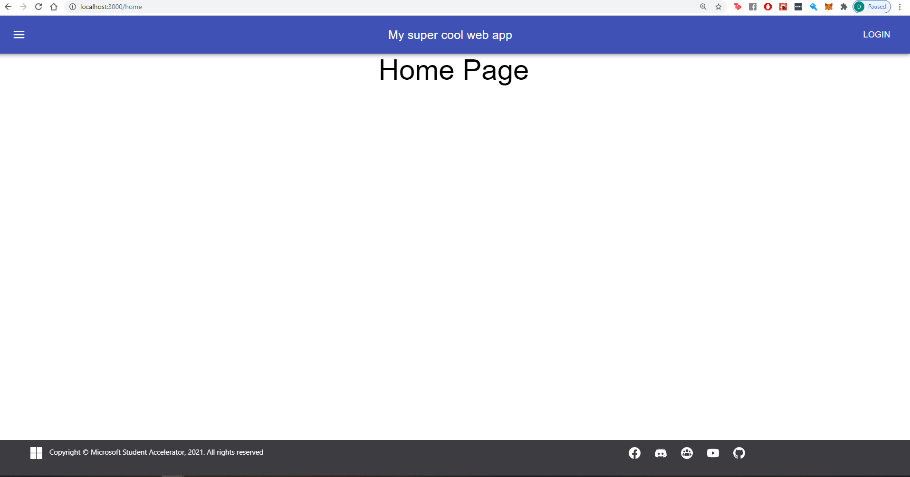

# React Router

[Official Documentation](https://reactrouter.com/)

So in the previous Section we built our `Sidebar.tsx` Component. Lets add routing and create new pages for our application to render.

As mentioned in the docs, there are three [Primary Components](https://reactrouter.com/web/guides/primary-components), Routers, Route matchers and Navigation - each serve a different purpose. Routers should be at the core of each application. `react-router-dom`. To use the router, which keeps track of your URL paths and routes, place a router in the root element. There are two different routers - `<HashRouter>` and `<BrowserRouter>`, in this example we will use BrowserRouter as it gives better looking URL's.

The router should live in the root element heirarchy so that your `<App/>` component is wrapped within the router and is able to use Routes.

`index.tsx`

```javascript
import React from "react";
import ReactDOM from "react-dom";
import "./index.css";
import App from "./App";
import { BrowserRouter } from "react-router-dom";

ReactDOM.render(
  <BrowserRouter>
    <App />
  </BrowserRouter>,
  document.getElementById("root")
);
```

Lets now go ahead and create some Route Matchers. According to the documentation, we add a `<Switch>` component which will then match each child `<Route>` and if the path matches will render the appropriate child component.

Add some pages first to render. Lets simply render a page with a simple title. In the src file create a new folder called Pages and create two folders for a `HomePage` and a `SubmitPage`.

Lets code up a simple page which will show a title for the relevant page.

`HomePage.tsx`

```javascript
import React from "react";
import { Typography } from "@material-ui/core";

export const HomePage = () => {
  return <Typography variant="h3">Home Page</Typography>;
};
```

`SubmitPage.tsx`

```javascript
import React from "react";
import { Typography } from "@material-ui/core";

export const SubmitPage = () => {
  return <Typography variant="h3">Submit Page</Typography>;
};
```

Now lets add some router logic to ensure that these pages are rendered when the URL of the page that is navigated to is either `/home` for the `HomePage` or `/submit` for the `SubmitPage`

`App.tsx`

```javascript
import React from 'react';
.
.
.
import { Route, Switch } from 'react-router';
import { HomePage } from './Pages/HomePage/HomePage';
import { SubmitPage } from './Pages/SubmitPage/SubmitPage';

function App() {
  return (
    <div className="App">
      <Header />
      <Switch>
        <Route path="/home" component={HomePage} />
        <Route path="/submit" component={SubmitPage} />
      </Switch>
      <Footer />
    </div>
  );
}
.
.
....
```

Lets now add these paths to our Sidebar to allow us to navigate to these paths.

`Sidebar.tsx`

```javascript
.
.
.

            <List>
                <ListItem button href="/home" component={Link}>
                    <ListItemIcon><HomeIcon /></ListItemIcon>
                    <ListItemText className={classes.listText} primary="Home" />
                </ListItem>
                <ListItem button href="/submit" component={Link}>
                    <ListItemIcon><ArrowUpwardIcon /></ListItemIcon>
                    <ListItemText className={classes.listText} primary="Submit" />
                </ListItem>
            </List>
            <Divider />
            <List>
                <ListItem button href="/login" component={Link}>
                    <ListItemIcon><AddBoxIcon /></ListItemIcon>
                    <ListItemText className={classes.listText} primary="Login" />
                </ListItem>
            </List>
.
.
.
...
```

Give it a try now! if you click on the Home or Submit buttons on the sidebar you should see a title showing the relevant page, and also the URL navigating to the route.



I'll leave the rest of the implmentation to you! Congrats you have now integrated React router with your application. Have a look at the [documentation](https://reactrouter.com/web/guides/quick-start) on what else is possible with React Router!

## Summary

In this part, we looked at how to implement basic navigation within our project. We learnt about Routers, and routes and switch components within React router dom, and how to use links to navigate within the webpage.

Next up we will talk about another third party library - Storybook which is primarily used as a component library.

[**<< Part #5 - Storybook >>**](5-storybook.md)
