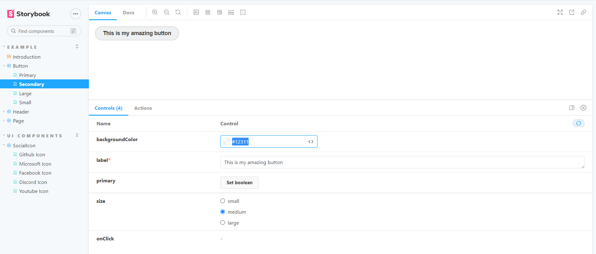

# Storybook :closed_book:

[Official Documentation](https://storybook.js.org/docs/react/get-started/introduction)

Storybook is at the core is an open source tool for building UI components and pages in isolation. It streamlines UI development, testing and documentation.

In this section we'll look at how to create new "stories", how to do basic manipulation and implement controls.

## Installation

In your root directly run the following command to install Storybook onto your existing project.

`npx sb init`

Once complete, you'll be able to run storybook on a seperate port.

`npm run storybook`

You'll see the storybook webapp has started in `localhost:6006` with some example stories on the left hand side.


## What is a story?

A story captures the rendered state of the component. We are able to write multiple "stories" describing the "interesting" states a component can support.

Lets break down and analyse the example story and have a go at integrating our `SocialIcon` component with storybook!

In the `Button.stories.tsx` file you'll notice there a template set up;

```typescript
const Template = (args) => <Button {...args} />;
```

This makes use of storybook's args concept and allows us to alter the composing arguements dynamically on the web browser.

There are 4 "states" that utilize this template binding - Primary, Secondary, Large and Small;

```typescript
export const Primary = Template.bind({});
Primary.args = {
  primary: true,
  label: 'Button',
};
.
.
.
.
.
.
.
.

export const Small = Template.bind({});
Small.args = {
  size: 'small',
  label: 'Button',
};
```

The args here describe the pre-built or "interesting" states in which we can set defaults for. In the storybook web app you can actually change the props within the `Button` component on the fly!



You can see how this can be extremely useful, being able to dynamically see and change how the component looks in a safe environment! Have a go and play around with the other args that are available.

There are a myriad of tools built into Storybook which help developers debug, develop and refine their components. One cool tip is this change view icon, where you can see how the component will look in a small mobile, large mobile or tablet view.


Under the docs tab, we can add documention such as how to use the component, and all the other things that come with _documentation_ heh.

Storybook picks up documentation straight from your component directly to storybook!

```typescript
interface ButtonProps {
  /**
   * Is this the principal call to action on the page?
   */
  primary?: boolean;
  /**
   * What background color to use
   */
  backgroundColor?: string;
  /**
   * How large should the button be?
   */
  size?: "small" | "medium" | "large";
  /**
   * Button contents
   */
  label: string;
  /**
   * Optional click handler
   */
  onClick?: () => void;
}

/**
 * Primary UI component for user interaction
 */
```


## Creating our own story using our components

Now we have got our hands dirty and disected a component in storybook, lets go ahead and create our own story for our `SocialIcon` component!

First create a `SocialIcon.stories.tsx` in the same folder as the `SocialIcon.tsx` and copy the following:

```
import React from 'react';
import githubLogo from "../../assets/logos/github_logo.svg"
import { Story, Meta } from '@storybook/react';
import { SocialIconProps, SocialIcon } from './SocialIcon';

export default {
    title: 'Example/SocialIcon',
    component: SocialIcon,
} as Meta;

const Template: Story<SocialIconProps> = (args) => (
    <div style={{ backgroundColor: "black" }}>
        <SocialIcon {...args} />
    </div>
)

export const GithubIcon = Template.bind({});
GithubIcon.args = {
    name: "GitHub",
    url: "https://github.com/nzmsa",
    logo: githubLogo
};
```

What we've done here is created another entry in the `Example` directory in storybook and added our component `SocialIcon`. I've put in a background color of black so we are able to see the icons render on the screen.


As you can see we've created a unique render of our Social Icon as Github Icon. Lets create some more unique render cases for our other scenarios

```typescript
export const MicrosoftIcon = Template.bind({});
MicrosoftIcon.args = {
  name: "Microsoft logo",
  url: "https://www.microsoft.com/en-nz",
  logo: microsoftLogo,
};

export const FacebookIcon = Template.bind({});
FacebookIcon.args = {
  name: "Facebook",
  url: "https://www.facebook.com/studentaccelerator/",
  logo: facebookLogo,
};
export const DiscordIcon = Template.bind({});
DiscordIcon.args = {
  name: "Discord",
  url: "https://discord.gg/c4Y5SAZ",
  logo: discordLogo,
};

export const YoutubeIcon = Template.bind({});
YoutubeIcon.args = {
  name: "YouTube",
  url: "https://www.youtube.com/channel/UCCegNuS_AZjK-P3ZMN3JXNw",
  logo: youtubeLogo,
};
```

You should now see a few other scenarios that are defined in Storybook under the SocialIcon component.


Well done we've just integrated our component with Storybook! Play around with using other arguments other than strings such as enum, boolean and see how your components can render dynmically as you are in control! :sunglasses:

Now for the finishing touches, lets add some documentation so people are able to know what each prop does and what function it serves.

```typescript
export interface SocialIconProps {
  /**
   * Name of the social icon
   */
  name: string;
  /**
   * URL that the social icon links to
   */
  url: string;
  /**
   * Imported svg file for the social icon to render its logo.
   */
  logo: string;
}

/**
 * Social Icon used to render social media icons
 */
export const SocialIcon: React.FC<SocialIconProps> = ({
  name,
  url,
  logo,
}) => {};
```

And tada! :tada: we've added documentation to our storybook.

In the workforce, storybook can be a powerful tool for Front-end developers needing to rapidly iterate through changes and creating new features quickly. Storybook helps achieve that by providing this tool and sandbox for developers to quickly see how their component interacts in an isolated space. Have a look at [Component driven design (CDD)](https://www.componentdriven.org/) and how building a [simple component](https://storybook.js.org/tutorials/intro-to-storybook/react/en/simple-component) can be built fully off storybook and exported to your application from a central component repository - such as Storybook!

## Summary

In this section we learnt about storybook, how to install and what a basic story is. We learnt how to run a local storybook server, dynamically change props to see the UI impacts and able to add our own story for our own component into storybook.

Next we'll be moving onto more exciting territory - Apollo client and how we can bring our components to life by hooking them up with our GraphQL backend service!

[**<< Part #6 - Apollo Client >>**](6-apollo-client.md)
