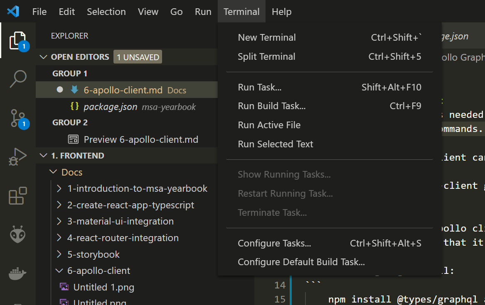
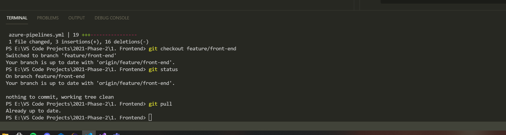
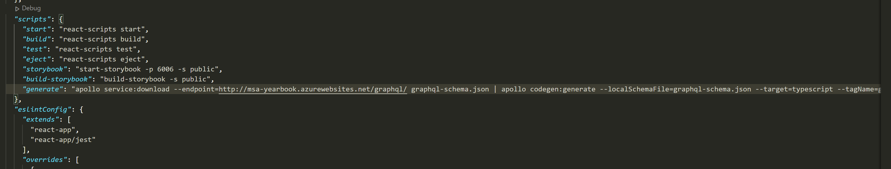
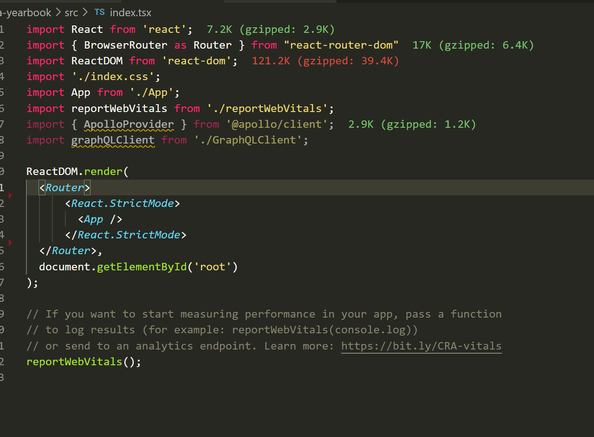
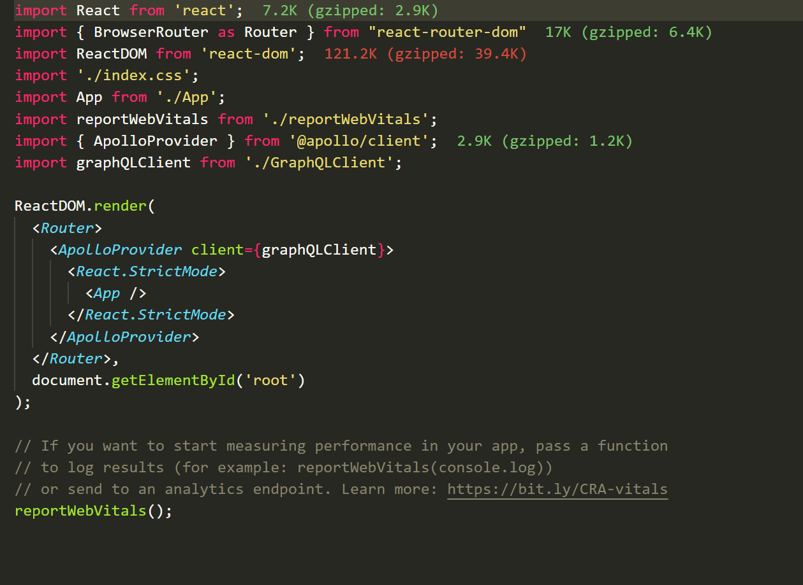
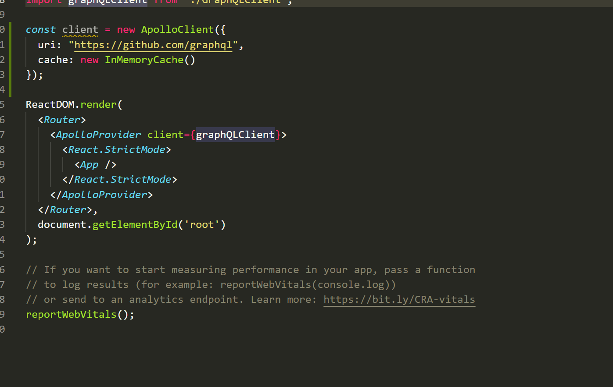
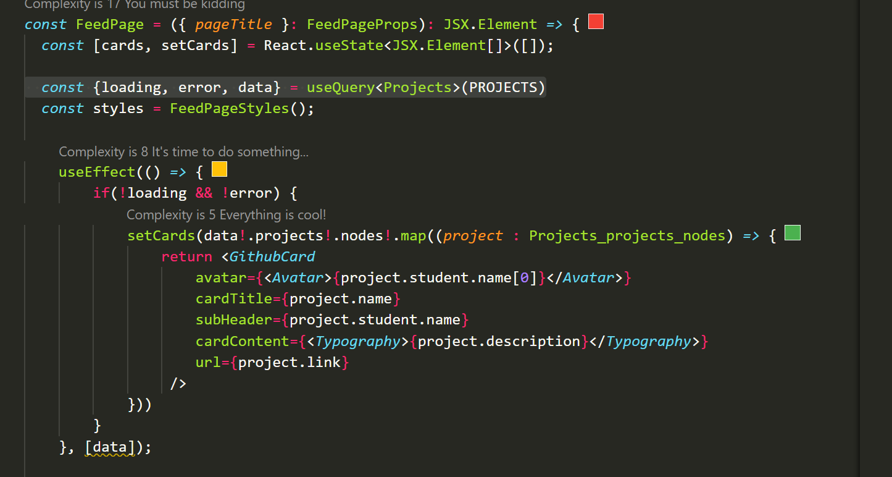
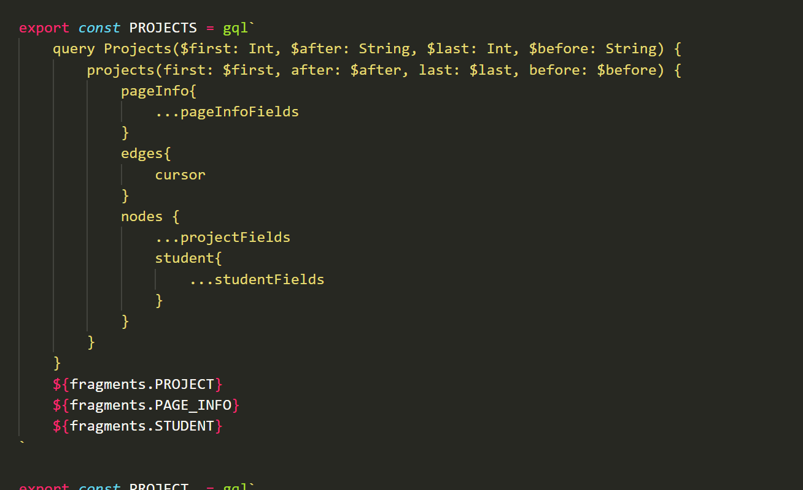

# Apollo GraphQL Client

## **1** - Installing the client
To install the libraries needed for interacting with our graphQL back-end, we will need to use a terminal to call some commands. You can find the VS Code integrated terminal from the top tabs, as per the image below:

  

This will open up the following window at the bottom of VS Code:

  

The client for apollo client can be installed using node package manager (npm). Start by calling:
```
    npm install @apollo/client graphql
```

This will install the apollo client, which we will use to interact with our graphQL back-end, and the graphql library that it requires to work.

We are then going to call:
```
    npm install @types/graphql apollo --save-dev
```

This will install the typescript types for the graphql library, and the types for the apollo client. The `--save-dev` tag in the command above will save these to developer dependencies, which won't be included in the final website (because they aren't needed for the website to run)

## **2** - Generating Client
We will then need to generate the client, which we can then use to call the graphQL API. To do this, we will first need to modify our **package.json** file. Add the following lines into the file as a script:
```
    "generate": "apollo service:download --endpoint=http://msa-yearbook.azurewebsites.net/graphql/ graphql-schema.json | apollo codegen:generate --localSchemaFile=graphql-schema.json --target=typescript --tagName=gql"
```

Your **package.json** file should have the scripts section looking like this once you've pasted the above code snippet in:

 

Now we need to use the terminal again. In the terminal at the bottom of VS Code, call the following command:
```
    npm run generate
```

This will download the graphQL schema file from the backend API, and then use that to create some code which we can then use to interact with the API.

## **3** - Integrating Apollo Client
To integrate the client, we will need to make some modifications to the code that we wrote earlier. To start, let's open up **index.tsx**, which should look something like this:

  

To allow the client code to access the back-end, we will need to add something called a *Provider*. Providers are a pattern used in React to *provide* the necessary bits of information to our code to allow it run. TL;DR: they utilise React context to provide the necessary information to the correct components.

As such, we will need to add `<ApolloProvider>` to the following file. Replace the contents of `ReactDOM.render()` with the following:
```
  <Router>
    <ApolloProvider client={graphQLClient}>
      <React.StrictMode>
        <App />
      </React.StrictMode>
    </ApolloProvider>
  </Router>,
  document.getElementById('root')
```

This should leave your **index.tsx** file looking similar to the image below:

  

Now, at this point, your code still won't compile. You'll notice that there is a red line underneath `graphQLClient`. This is because we haven't yet defined the client parameters correctly yet. Let's remedy that, and add the following code into **index.tsx**:
```
const graphQLClient = new ApolloClient({
    uri: YOUR_HTTP_LINK,
    cache: new InMemoryCache()
});
```

This should leave **index.tsx** looking like this (NB the actual graphQL endpoint for GitHub is actually https://api.github.com/graphql):

  

Now that the client has been provided to the rest of our code, we can now start using it to call the API.

## **4** - Calling GraphQL
To use the apollo client to query graphQL, we now need to call `useQuery`. Add the following snippet of code to your component:
```
    const {loading, error, data} = useQuery<Projects>(PROJECTS)
```

You can find an example of this being used in **FeedPage.tsx**:

  

In the above image, the use of `useEffect(() => { ...SOME CODE...}, [data])` lets this component update it's state once the data that is provided by the graphQL query is finished fetching data!

If you look into the generated code, in **queries.ts**, you will find the following code:

  

This is the PROJECTS query that is being called by us in our code, through `useQuery`!


## Summary
The apollo client can be used to interact with graphQL libraries, without needing to write a lot of boiler-plate code that is extremely repetitive. This is achieved by using the client library to generate a lot of code, and using that code to help us use a small number of hooks to interact with graphQL.

I would highly recommend some further reading up on graphQL before you really get into using it. We have covered how to programmatically fire off a query to graphQL in this section, but there are other query types, as well as many other topics on graphQL! The following link is useful for further reading:

- GraphQL Learning Documentation: https://graphql.org/learn/
- Apollo Client Documentation: https://www.apollographql.com/docs/react/development-testing/static-typing/#gatsby-focus-wrapper

[**<< Part #7 - Azure Deployment >>**](7-azure-development.md)
