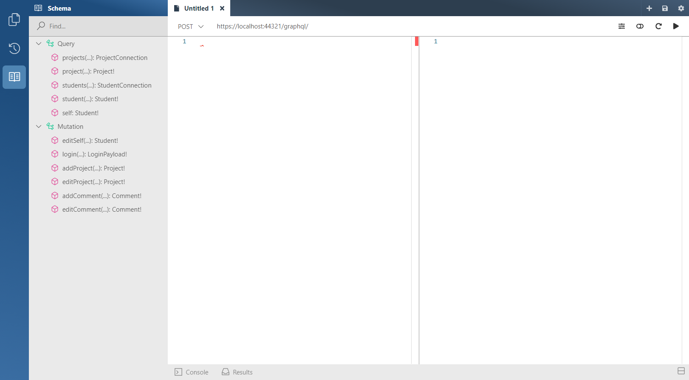

# Introduction

> Update: We noticed that this workshop may be very heavy, we recommend you to read over resources and try to understand the content.

The following workshop teaches you how to make a GraphQL API using Hot Chocolate in .NET 5 using Code-First/Annotation-First. We will be building a simple backend for a simple web app for storing and showcasing student repos. We will be going through the following basic requirements from the assignment:

IDE - you may use any IDE, e.g. [Visual Studio](https://visualstudio.microsoft.com/), [Rider](https://www.jetbrains.com/rider/) or Visual Studio Code.

- Create a backend using GraphQL, saving data to a relational database with
  Entity Framework.

Our simple API would store the following things:

- **Students** - Represents each student part of MSA
- **Projects** - A Student's Project. A student can have multiple Projects
- **Comments** - All students may comment on any Project. A Project may have multiple Comments

#### Recommended resources

- Read more about GraphQL at https://graphql.org/learn/
- Read more about Entity Framework (ORM) https://docs.microsoft.com/en-us/ef/
- Read more about Hot Chocolate at https://chillicream.com/docs/hotchocolate/
- Read more about ASP.NET at https://dotnet.microsoft.com/apps/aspnet/apis

#### Recommended tutorials

- [GraphQL API with .NET 5 and Hot Chocolate by Les Jackson](https://www.youtube.com/watch?v=HuN94qNwQmM)
- [GraphQL Workshop](https://github.com/ChilliCream/graphql-workshop)
- [Hot Chocolate Examples](https://github.com/ChilliCream/hotchocolate-examples)

**_Final Product:_**

The following is a GraphQL client provided by Hot Chocolate a GraphQL framework which we will be using.

### Database Table Structure

PK stands for Primary Key in SQL Server
FK stands for Foreign Key in SQL Server

_Relationships_:

Student - one to many - Projects
Project - one to many - Comments
Student - one to many - Comments

### Advance Requirement Resources (optional):

We will not be covering the follow (self study :blush:)

- Integrate a call to a public API and use the data in a meaningful way.

  - GitHub using [octokit](https://octokitnet.readthedocs.io/en/latest/)
  - MSA 2019 Phase 2 - [Youtube API](https://github.com/NZMSA/2019-Phase-2/tree/master/2.%20API/Part4-YouTubeAPI)
  - Any public API

- Use DataLoader library to optimise the calls for data fetching.
  - [Offical Docs](https://chillicream.com/docs/hotchocolate/fetching-data/dataloader)

## Summary

Lets start creating our project!

[**<< Part #2 - Azure Database >>**](2-azure-sql-database.md)

Click above to goto next page :smirk:
