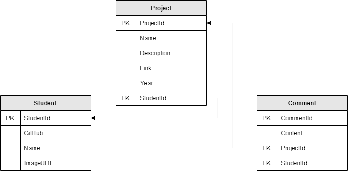

# Introduction

The following workshop teaches you how to make a GraphQL API using Hot Chocolate in .NET 5. We will be building a simple backend for a simple web app for storing and showcasing student repos. We will be going through the following basic requirements from the assignment:

- Create a backend using GraphQL, saving data to a relational database with
  Entity Framework.

Our simple API would store the following things:

- **Students** - Represents each student part of MSA
- **Projects** - A Student's Project. A student can have multiple Projects
- **Comments** - All students may comment on any Project. A Project may have multiple Comments

Final Product:

### Database Table Structure

### Advance Requirement Resources (optional):

- Integrate a call to a public API and use the data in a meaningful way.

  - GitHub using [octokit](https://octokitnet.readthedocs.io/en/latest/)
  - MSA 2019 Phase 2 - [Youtube API](https://github.com/NZMSA/2019-Phase-2/tree/master/2.%20API/Part4-YouTubeAPI)
  - Any public API

- Use DataLoader library to optimise the calls for data fetching.
  - [Offical Docs](https://chillicream.com/docs/hotchocolate/fetching-data/dataloader)

## Summary

Lets start!

[**<< Part #2 - Azure Database >>**](2-azure-sql-database.md)
