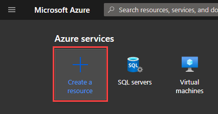

# Azure Database

Before we can build our model we first need a server to host our database. There are multiple ways and technologies we could use to create a database. For simplicity, we will use Azure SQL databases to host our data. For this step, you will need an Azure for Student Subscription and an account to go with it. Visit [azure.microsoft.com/en-us/free/students](http://azure.microsoft.com/en-us/free/students) to redeem your subscription. This will give you some free credits to host our API and Databases.

### 1.1 Creating the database

Navigate to [portal.azure.com](https://portal.azure.com/) on your browser and click **Create a resource** and search for **SQL Database**.

> Make sure the subscription is Azure for Students (Note the following creation will cost your student credits).

- Click **Create New**, to create a new resource group. (The resource group is a collection of resources that are used for a particular application or group of applications)

- Name your database e.g msa-yearbook

- Click Create new which will prompt you to create an admin account for this database and then select a region that it will be hosted on.

- You should have something similar to this (Australia East is where we are closest). Make sure you note down your username and password

- Click **Configure database** and navigate to the basic option (the default one is overkill and is quite expensive for our purposes) and apply the changes.

We want to change the database configuration because the default one is expensive and overkill for our purposes. Since we are going to use this database for learning, serverless is a sweet option as it costing the least.

We want to select Locally-redundant backup storage. Locally-redundant storage (LRS) copies your data synchronously three times within a single physical location in the primary region. LRS is the least expensive replication option but is not recommended for applications requiring high availability or durability.

- Review and create the SQL Database

Once satisfied with the setting you can click review and create and the deployment should be underway. This might take some time.

### 3.2 Firewall settings

When the database has finished being deployed you can click on "Go to resource" and 'Set server firewall'.

Change the setting so that 'Allow Azure service' is Yes and add the rule 0.0.0.0 and 255.255.255.255. This is giving all IP addresses access. Ideally, we would want to restrict access in a production environment but for simplicity, I will allow all connections. Make sure to save before exiting.

On the left hand panel find the label Connection String and copy the string somewhere. (We would need this to connect to the database we created in the .NET project)

Copy the connection string under ADO.NET.

## Summary

In this part, we covered how to create a SQL database on Azure cloud and how to get credentials for accessing your database.

[**<< Part #3 - Create Project in VS >>**](3-create-an-empty-project-using-visual-studio.md)
