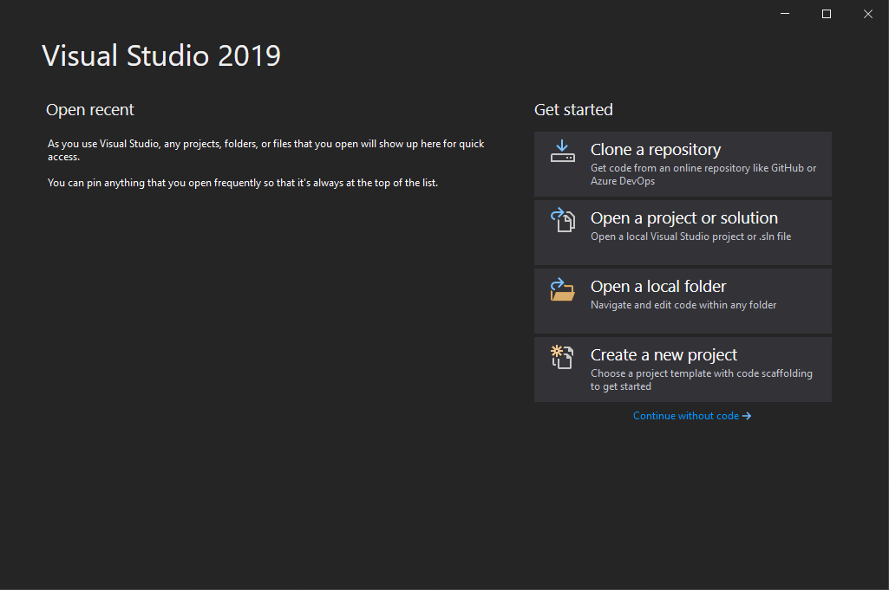

# Create an empty Project using Visual Studio

Open Visual Studio 2019 -> Create a new Project -> ASP.NET Core Web API

Give your project a name.

Choose NET 5 and deselect OpenAPI support as we will not be using it.

We have created an empty API project which will create a basic REST API. At this point, you can Click IIS Express to run the project. The newly created API project comes with a default API WeatherForecastController.cs, It should show you the following data.

## Summary

In this part, we went through how to create a template project in Visual Studio. We will be using this empty template project to build our API on top of.

[**<< Part #4 - Nuget Packages >>**](4-adding-nuget-packages.md)
