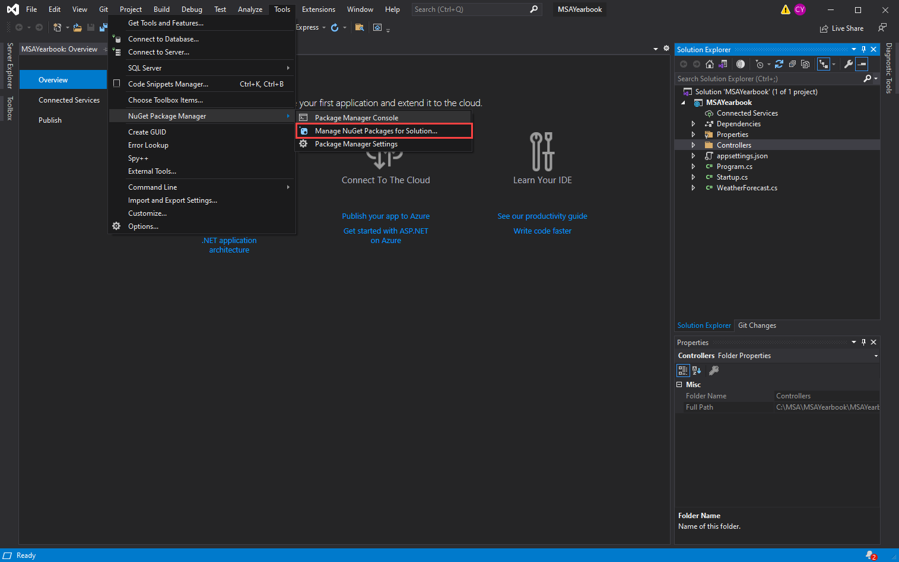

# Adding Nuget Packages

We want to add all the required packages before we move on to coding (for in-person students).

Packages we want to add:

| Name                                          | Usage                                                                                                                 |
| --------------------------------------------- | --------------------------------------------------------------------------------------------------------------------- |
| Microsoft.EntityFrameworkCore                 | This framework is an ORM (Object-Relational Mapper) that allows developers to work with a database using .NET objects |
| Microsoft.EntityFrameworkCore.SqlServer       | Allows the ORM to use Microsoft SQL Server (database communication)                                                   |
| Microsoft.EntityFrameworkCore.Tools           | Tools for database migrations                                                                                         |
| HotChocolate.AspNetCore                       | Hot Chocolate GraphQL endpoint                                                                                        |
| HotChocolate.Data                             | Hot Chocolate Data management                                                                                         |
| HotChocolate.Data.EntityFramework             | Hot Chocolate Data management for Entity Framework                                                                    |
| HotChocolate.AspNetCore.Authorization         | Hot Chocolate Authorization Library                                                                                   |
| Microsoft.AspNetCore.Authentication.JwtBearer | JWT library to generate Bearer tokens                                                                                 |
| Octokit                                       | GitHub .NET library                                                                                                   |

The following are different methods of install the above packages. For windows users we recommend using package manager and for macOS users we recommend using .NET CLI.

### Use Manage Package for Solution (UI)

We also need to install some libraries/extensions to the project to help us create the API. At the top of the screen go to **Tools** -> **Nuget Package Manager** -> **Manage Nuget Package for Solution.**



Search each package from the above table and install it. e.g Microsoft.EntityFrameworkCore


### Use Package Manager Console (CLI, command line)

I prefer using the CLI as I won't need to search each package manually.


```bash
Install-Package Microsoft.EntityFrameworkCore
Install-Package Microsoft.EntityFrameworkCore.SqlServer
Install-Package Microsoft.EntityFrameworkCore.Tools
Install-Package HotChocolate.AspNetCore
Install-Package HotChocolate.Data
Install-Package HotChocolate.Data.EntityFramework
Install-Package HotChocolate.AspNetCore.Authorization
Install-Package Microsoft.AspNetCore.Authentication.JwtBearer
Install-Package Octokit
```

### Use .NET CLI

Another CLI for people who don't have Package Manager Console

```bash
dotnet add package Microsoft.EntityFrameworkCore
dotnet add package Microsoft.EntityFrameworkCore.SqlServer
dotnet add package Microsoft.EntityFrameworkCore.Tools
dotnet add package HotChocolate.AspNetCore
dotnet add package HotChocolate.Data
dotnet add package HotChocolate.Data.EntityFramework
dotnet add package HotChocolate.AspNetCore.Authorization
dotnet add package Microsoft.AspNetCore.Authentication.JwtBearer
dotnet add package Octokit
```

## Summary

In this part, we explored three different ways to install nuget packages (.NET's packages) and the list of packaging that we would be required to install for our project. It is recommended to install these now as it would take time to install.

[**<< Part #5 - Nuget Packages >>**](5-setup-hot-chocolate.md)
