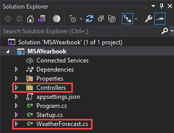

# Setup Hot Chocolate

Every taught here would be referenced from Hot Chocolate v11
Read more: [Hot Chocolate Docs](https://chillicream.com/docs/hotchocolate/)

1. To start let us remove everything that is unnecessary. Delete the following files/folders

   1. `./Controller` (Folder)
   2. `./WeatherForecast.cs` (File)

   

2. Add 2 new folder `Model` and `Data`where we want to place all our database related code.

   Right Click `MSAYearbook` → `Add` → `New Folder`

   

3. Add a new item Class `Student.cs` in the `Models` directory using the following code:

   ```csharp
   using System.ComponentModel.DataAnnotations;

   namespace MSAYearbook.Models
   {
       public class Student
       {
           [Key]
           public int Id { get; set; }

           [Required]
           public string Name { get; set; }

           [Required]
           public string GitHub { get; set; }

           public string ImageURI { get; set; }
       }
   }
   ```

   Right Click `MSAYearbook` → `Add` → `New Item`

   

   For more info about entity framework checkout [here](https://docs.microsoft.com/en-us/aspnet/mvc/overview/getting-started/getting-started-with-ef-using-mvc/creating-an-entity-framework-data-model-for-an-asp-net-mvc-application#install-entity-framework-6)

4. Next, we'll create a new Entity Framework DbContext. Create a new `AppDbContext` class in the `Data` folder using the following code:

   ```csharp
   using Microsoft.EntityFrameworkCore;
   using MSAYearbook.Models;

   namespace MSAYearbook.Data
   {
       public class AppDbContext : DbContext
       {
           public AppDbContext(DbContextOptions options) : base(options) { }

           public DbSet<Student> Students { get; set; }
       }
   }
   ```

5. Register the DB Context Service

   Add the following code to the top of the ConfigureServices() method in Startup.cs:

   ```csharp
   // This method gets called by the runtime. Use this method to add services to the container.
   public void ConfigureServices(IServiceCollection services)
   {
     services.AddPooledDbContextFactory<AppDbContext>(options => options.UseSqlServer(Configuration.GetConnectionString("DefaultConnection")));
   }
   ```

6. Now that we have set up our model and the context, we can begin to update the database with our model. Code first programming will allow us to mirror our model in our database. First, remember we had the connection previously when we created our database. Open `appsettings.Development.json` and add the following. (where `Server=tcp:msa-yearbook-db.data...` is the string you copied earlier when we created the database in Azure Portal)

   ```json
   {
   	...
   	"AllowedHosts": "*",
     "ConnectionStrings": {
       "DefaultConnection": "Server=tcp:msa-yearbook-db.database.windows.net,1433;Initial Catalog=msa-yearbook-db;Persist Security Info=False;User ID=cz;Password={your_password}..."
     }
   }
   ```

   > It is a good idea to git ignore this file (`appsettings.Development.json`) before creating a git repo.

7. Configuring EF Migrations

   1. In Visual Studio, select the Tools -> NuGet Package Manager -> Package Manager Console
   2. Run the following commands in the Package Manager Console

      ```bash
      Add-Migration Initial
      Update-Database
      ```

8. Create a new folder `GraphQL` and a subfolder `Students`

   Add a new item in `GraphQL/Student` called `StudentQueries.cs`

   

   Insert the following code to define a query

   ```csharp
   using System.Linq;
   using HotChocolate;
   using MSAYearbook.Data;
   using MSAYearbook.Model;

   namespace MSAYearbook.GraphQL.Students
   {
       [ExtendObjectType(name: "Query")]
       public class StudentQueries
       {
           public IQueryable<Student> GetStudents([Service] AppDbContext context)
           {
               return context.Students;
           }
       }
   }
   ```

9. Before we can do anything with our query root type we need to set up `GraphQL` and register our query root type. Add the following code below `AddDbContext` in the `ConfigureServices()` method in `Startup.cs`:

   ```csharp
   public void ConfigureServices(IServiceCollection services)
   {
       services.AddPooledDbContextFactory<AppDbContext>(options => options.UseSqlServer(Configuration.GetConnectionString("DefaultConnection")));

       services
           .AddGraphQLServer()
           .AddQueryType(d => d.Name("Query"))
               .AddTypeExtension<StudentQueries>();
   }
   ```

   Change `Configure()` method in `Startup.cs` to use GraphQL endpoints

   ```csharp
   public void Configure(IApplicationBuilder app, IWebHostEnvironment env)
   {
       if (env.IsDevelopment())
       {
           app.UseDeveloperExceptionPage();
       }

       appx
           .UseRouting()
           .UseEndpoints(endpoints =>
           {
               endpoints.MapGraphQL();
           });
   }
   ```

10. Let's try running our application. Click `IIS Express`

    

    This will open up a link in your browser e.g. `https://localhost:00000/graphql/`

    

    `students` the schema we have just defined and we can see all the fields that students have.

## Summary

We covered how to setup a very basic GraphQL server with a basic query based on an Entity Framework model. We learn now to create a basic Entity Framework model and learn how to use the framework to perform migrations and connect to the SQL server. We will be using this basic project structure and be building ontop of this to complete our API.

[**<< Part #6 - GraphQL Queries >>**](6-implement-graphql-queries.md)
