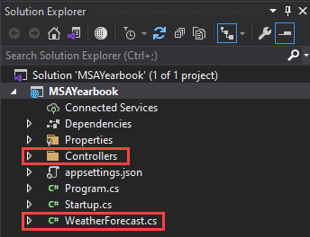

# Setup Hot Chocolate

Every taught here would be referenced from Hot Chocolate v11
Read more: [Hot Chocolate Docs](https://chillicream.com/docs/hotchocolate/)

1.  To start let us remove everything that is unnecessary. Delete the following files/folders

    1.  `./Controller` (Folder)
    2.  `./WeatherForecast.cs` (File)

    You project should look something like this:
    

2.  Add 2 new folder `Model` and `Data` where we want to place all our database related code. _(Note: I spelt it wrong on the video/presentation, this doesn't matter just make sure you are consistent in your implementation)_

    Right Click `MSAYearbook` → `Add` → `New Folder`

    

    The `Model` folder will be where we will add all our Entity Framework Models, to learn more click [here](https://docs.microsoft.com/en-us/ef/core/modeling/)

    The `Data` folder is where we will be keeping our DbContext - used to access the database schema - [read more](https://docs.microsoft.com/en-us/ef/core/cli/dbcontext-creation?tabs=dotnet-core-cli)

3.  Add a new item Class `Student.cs` in the `Models` directory using the following code:

    ```csharp
    using System.ComponentModel.DataAnnotations;

    namespace MSAYearbook.Models
    {
        public class Student
        {
            [Key]
            public int Id { get; set; }

            [Required]
            public string Name { get; set; }

            [Required]
            public string GitHub { get; set; }

            public string ImageURI { get; set; }
        }
    }
    ```

    We want to make `Id` a Key attribute (`[Key]`) as we want to use it as a Primary Key in Entity Framework.
    Since the fields Name and GitHub are required fields we will ad the attribute `[Required]`

    

    Right Click `MSAYearbook` → `Add` → `New Item`

    For a full guide about entity framework checkout [here](https://docs.microsoft.com/en-us/aspnet/mvc/overview/getting-started/getting-started-with-ef-using-mvc/creating-an-entity-framework-data-model-for-an-asp-net-mvc-application#install-entity-framework-6)

4.  Next, we'll create a new Entity Framework DbContext. Create a new `AppDbContext` class in the `Data` folder using the following code:

    ```csharp
    using Microsoft.EntityFrameworkCore;
    using MSAYearbook.Models;

    namespace MSAYearbook.Data
    {
        public class AppDbContext : DbContext
        {
            public AppDbContext(DbContextOptions options) : base(options) { }

            public DbSet<Student> Students { get; set; }
        }
    }
    ```

    DbContext associated to a model to:

    - Write and execute queries
    - Materialize query results as entity objects
    - Track changes that are made to those objects
    - Persist object changes back on the database
    - Bind objects in memory to UI controls

    > Note: DbContext is single threaded and will not work with multithreaded request (this will be important later)

    We want to define a class that derives from DbContext and exposes `DbSet` properties that represent collections of the specified entities in the context.

    Read more about [DbContext](https://docs.microsoft.com/en-us/ef/ef6/fundamentals/working-with-dbcontext)

5.  Register the DB Context Service

    Add the following code to the top of the ConfigureServices() method in Startup.cs:

    ```csharp
    // This method gets called by the runtime. Use this method to add services to the container.
    public void ConfigureServices(IServiceCollection services)
    {
      services.AddPooledDbContextFactory<AppDbContext>(options => options.UseSqlServer(Configuration.GetConnectionString("DefaultConnection")));
    }
    ```

6.  Now that we have set up our model and the context, we can begin to update the database with our model. Code first programming will allow us to mirror our model in our database. First, remember we had the connection previously when we created our database. Open `appsettings.Development.json` and add the following. (where `Server=tcp:msa-yearbook-db.data...` is the string you copied earlier when we created the database in Azure Portal)

    ```json
    {
    	...
    	"AllowedHosts": "*",
      "ConnectionStrings": {
        "DefaultConnection": "Server=tcp:msa-yearbook-db.database.windows.net,1433;Initial Catalog=msa-yearbook-db;Persist Security Info=False;User ID=cz;Password={your_password}..."
      }
    }
    ```

    > It is a good idea to git ignore this file (`appsettings.Development.json`) before creating a git repo.

7.  Configuring EF Migrations

        1.  In Visual Studio, select the Tools -> NuGet Package Manager -> Package Manager Console
        2.  Run the following commands in the Package Manager Console

            ```bash
            Add-Migration Initial
            Update-Database
            ```

            For macOS users open terminal and navigate to your project directory and run (also works for Windows using cmd)
            ```bash
            dotnet ef migrations add Initial
            dotnet ef database update
            ```

            > This may fail due to your serverless SQL server is not running. Serverless SQL servers are slower on Cold boot you might want to retry after a few seconds.

8.  Create a new folder `GraphQL` and a subfolder `Students`

    Add a new item in `GraphQL/Student` called `StudentQueries.cs`

    

    Insert the following code to define a query

    ```csharp
    using System.Linq;
    using HotChocolate;
    using MSAYearbook.Data;
    using MSAYearbook.Model;

    namespace MSAYearbook.GraphQL.Students
    {
        [ExtendObjectType(name: "Query")]
        public class StudentQueries
        {
            public IQueryable<Student> GetStudents([ScopedService] AppDbContext context)
            {
                return context.Students;
            }
        }
    }
    ```

    We want to use ExtendObjectType to change the extent this classes name with `Query` to allow Hot Chocolate to identify this as a query class.
    We want to add a get method called `GetStudents` Hot Chocolate will see this method as `students` in the schema.
    Hot Chocolate is integrated well with Entity Framework and can take in IQueryable objects from Entity Framework. Hot Chocolate will deal with this themselves.
    Read more about [Hot Chocolate and Entity Framework integration](https://chillicream.com/docs/hotchocolate/integrations/entity-framework)

9.  Before we can do anything with our query root type we need to set up `GraphQL` and register our query root type. Add the following code below `AddDbContext` in the `ConfigureServices()` method in `Startup.cs`:

    ```csharp
    public void ConfigureServices(IServiceCollection services)
    {
        services.AddPooledDbContextFactory<AppDbContext>(options => options.UseSqlServer(Configuration.GetConnectionString("DefaultConnection")));

        services
            .AddGraphQLServer()
            .AddQueryType(d => d.Name("Query"))
                .AddTypeExtension<StudentQueries>();
    }
    ```

    Your `ConfigureServices` should look like the above _(Note: you can delete the controller as we will not be using it)_

    Change `Configure()` method in `Startup.cs` to use GraphQL endpoints

    ```csharp
    public void Configure(IApplicationBuilder app, IWebHostEnvironment env)
    {
        if (env.IsDevelopment())
        {
            app.UseDeveloperExceptionPage();
        }

        app.UseRouting()

        app.UseEndpoints(endpoints =>
            {
                endpoints.MapGraphQL();
            });
    }
    ```

    _(Note: you can keep `app.UseHttpsRedirection()` if you want to, it redirects you from `http` to `https`)_

10. Let's try running our application. Click `IIS Express`

    

    This will open up a link in your browser, navigate to /graphql e.g. `https://localhost:00000/graphql/`

    You can change the default lanuch url by going into debug properties _(should have came to presentation 😉)_

    

    `students` the schema we have just defined and we can see all the fields that students have. These fields are translated directly from the Entity Framework models we defined.

## Summary

We covered how to setup a very basic GraphQL server with a basic query based on an Entity Framework model. We learn now to create a basic Entity Framework model and learn how to use the framework to perform migrations and connect to the SQL server. We will be using this basic project structure and be building ontop of this to complete our API.

[**<< Part #6 - GraphQL Queries >>**](6-implement-graphql-queries.md)
