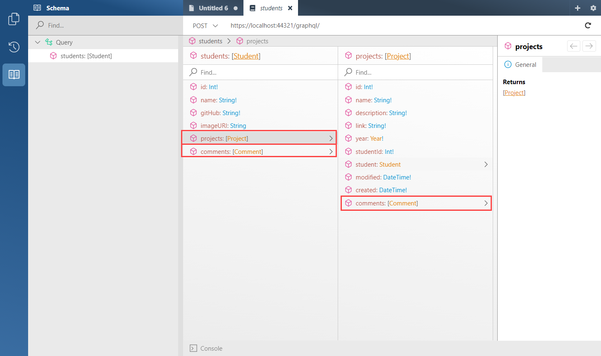

# Implement Queries

> The following workshop will become substantially harder from this point. Hightly recommend self studing the code.


1.  Let's define our relational data shown in the above diagram using Entity Framework models we learnt earlier.

    Add a new item Class `Project.cs` in the `Model` directory using the following code:

    ```csharp
    using System;
    using System.Collections.Generic;
    using System.ComponentModel.DataAnnotations;

    namespace MSAYearbook.Models
    {
        public enum Year
        {
            YEAR_2021
        }

        public class Project
        {
            [Key]
            public int Id { get; set; }

            [Required]
            public string Name { get; set; } = null!;

            [Required]
            public string Description { get; set; } = null!;

            [Required]
            public string Link { get; set; } = null!;

            [Required]
            public Year Year { get; set; }

            [Required]
            public int StudentId { get; set; }

            public Student Student { get; set; } = null!;

            public DateTime Modified { get; set; }

            public DateTime Created { get; set; }

            public ICollection<Comment> Comments { get; set; } = new List<Comment>();
        }
    }
    ```

    We have a `ICollection` of comments as we want the model to be able to access an Array of comments.

    > We are using enums for Year as we want our platform to be able to be resued every year. It's a multiple year yearbook!

    Add a new item Class `Comment.cs` in the `Model` directory using the following code:

    ```csharp
    using System;
    using System.ComponentModel.DataAnnotations;

    namespace MSAYearbook.Models
    {
        public class Comment
        {
            [Key]
            public int Id { get; set; }

            [Required]
            public string Content { get; set; } = null!;

            [Required]
            public int ProjectId { get; set; }

            public Project Project { get; set; } = null!;

            [Required]
            public int StudentId { get; set; }

            public Student Student { get; set; } = null!;

            public DateTime Modified { get; set; }

            public DateTime Created { get; set; }

        }
    }
    ```

    In here we have two foreign keys `ProjectId` and `StudentId`. Each of these keys would resolve into a relation linked to one Project and one Student

    Edit `Student.cs` in the `Model` with the following

    ```csharp
    using System.Collections.Generic;
    using System.ComponentModel.DataAnnotations;

    namespace MSAYearbook.Models
    {
        public class Student
        {
            [Key]
            public int Id { get; set; }

            [Required]
            public string Name { get; set; }

            [Required]
            public string GitHub { get; set; }

            public string ImageURI { get; set; }

            public ICollection<Project> Projects { get; set; } = new List<Project>();

            public ICollection<Comment> Comments { get; set; } = new List<Comment>();
        }
    }
    ```

    The ICollection and Objects we have just defined will not be processed by Entity Framework by default, we will need to define them inside our relations to let Entity Framework know how to deal with these fields.

2.  We want to add our newly defined models and the foreign key relationship between them in `AppDbContext.cs`.

    Edit `AppDbContext.cs` in `Data` to add the two new models we have just created. In here we also need to define the entity relationships between our models.

    ```csharp
    using MSAYearbook.Models;
    using Microsoft.EntityFrameworkCore;

    namespace MSAYearbook.Data
    {
        public class AppDbContext : DbContext
        {
            public AppDbContext(DbContextOptions options) : base(options) { }

            public DbSet<Project> Projects { get; set; }
            public DbSet<Comment> Comments { get; set; }
            public DbSet<Student> Students { get; set; }

            protected override void OnModelCreating(ModelBuilder modelBuilder)
            {
                modelBuilder.Entity<Project>()
                    .HasOne(p => p.Student)
                    .WithMany(s => s.Projects)
                    .HasForeignKey(p => p.StudentId);

                modelBuilder.Entity<Comment>()
                    .HasOne(c => c.Student)
                    .WithMany(s => s.Comments)
                    .HasForeignKey(c => c.StudentId)
                    .OnDelete(DeleteBehavior.NoAction);

                modelBuilder.Entity<Comment>()
                    .HasOne(c => c.Project)
                    .WithMany(p => p.Comments)
                    .HasForeignKey(c => c.ProjectId);
            }
        }
    }
    ```

    Using the following code we can define the ICollection from s.Projects and the Object p.Student are in a one to many relationship on the Project model.

    ```csharp
    modelBuilder.Entity<Project>()
        .HasOne(p => p.Student)
        .WithMany(s => s.Projects)
        .HasForeignKey(p => p.StudentId);
    ```

    > You would notice`.OnDelete(DeleteBehavior.NoAction);` is only used on Comment. This is because Microsoft SQL Server doesn't support multiple cascades on one table. For our case, we will not be removing any students/projects so we can just disable cascade (remove when a parent is removed).

3.  Let's make an entity framework migration with our new database schema

    1.  In Visual Studio, select the Tools -> NuGet Package Manager -> Package Manager Console
    2.  Run the following commands in the Package Manager Console

        ```bash
        Add-Migration AddProjectAndComment
        Update-Database
        ```

        For macOS users open terminal and navigate to your project directory and run (also works for Windows using cmd)

        ```bash
        dotnet ef migrations add Initial
        dotnet ef database update
        ```

        > This may fail due to your serverless SQL server is not running. Serverless SQL servers are slower on Cold boot you might want to retry after a few seconds.

4.  Now we have implemented all our models. let's run our API again!

    

    You will notice there are now two objects available under Students. One is Projects and the other are Comments. Under Projects, there are also Comments.

    These fields are all extracted by Hot Chocolate by looking at your model :grin:

5.  For us to use nested queries e.g `Student -> Project -> Comment` . We must introduce resolvers. Resolvers are placed on the types of objects.

    What happens is that when you call a nested object using Hot Chocolate, it doesn't know how to deal with nested calls. To fix this we want to tell Hot Chocolate that it can resolve it using a certain query.

    Before adding resolvers we need to create a type for each object. Hot Chocolate will see this type and use it instead of the model from entity framework. With the type defined we can add resolvers on the type which Hot Chocolate would automatically find.

    Add a new item Class `StudentType.cs` in the `GraphQL/Student` directory using the following code:

    ```csharp
    using System.Linq;
    using System.Threading;
    using System.Threading.Tasks;
    using System.Collections.Generic;
    using Microsoft.EntityFrameworkCore;
    using HotChocolate;
    using HotChocolate.Types;
    using MSAYearbook.Data;
    using MSAYearbook.Models;
    using MSAYearbook.GraphQL.Projects;
    using MSAYearbook.GraphQL.Comments;

    namespace MSAYearbook.GraphQL.Students
    {
        public class StudentType : ObjectType<Student>
        {
            protected override void Configure(IObjectTypeDescriptor<Student> descriptor)
            {
                descriptor.Field(s => s.Id).Type<NonNullType<IdType>>();
                descriptor.Field(s => s.Name).Type<NonNullType<StringType>>();
                descriptor.Field(s => s.GitHub).Type<NonNullType<StringType>>();
                descriptor.Field(s => s.ImageURI).Type<NonNullType<StringType>>();

                descriptor
                    .Field(s => s.Projects)
                    .ResolveWith<Resolvers>(r => r.GetProjects(default!, default!, default))
                    .UseDbContext<AppDbContext>()
                    .Type<NonNullType<ListType<NonNullType<ProjectType>>>>();

                descriptor
                    .Field(s => s.Comments)
                    .ResolveWith<Resolvers>(r => r.GetComments(default!, default!, default))
                    .UseDbContext<AppDbContext>()
                    .Type<NonNullType<ListType<NonNullType<CommentType>>>>();
            }

            private class Resolvers
            {
                public async Task<IEnumerable<Project>> GetProjects(Student student, [ScopedService] AppDbContext context,
                    CancellationToken cancellationToken)
                {
                    return await context.Projects.Where(c => c.StudentId == student.Id).ToArrayAsync(cancellationToken);
                }

                public async Task<IEnumerable<Comment>> GetComments(Student student, [ScopedService] AppDbContext context,
                    CancellationToken cancellationToken)
                {
                    return await context.Comments.Where(c => c.StudentId == student.Id).ToArrayAsync(cancellationToken);
                }
            }
        }
    }
    ```

    We are using Code-first syntax shown in `descriptor.Field(s => s.Id).Type<NonNullType<IdType>>();` Read more [here](https://chillicream.com/docs/hotchocolate/defining-a-schema/object-types#explicit-types)

    We can bind a resolver to a field by the following

    ```csharp
    descriptor
        .Field(s => s.Comments) // Field
        .ResolveWith<Resolvers>(r => r.GetComments(default!, default!, default)) // Calling a resolver (default just means passing in a same value as parent)
        .UseDbContext<AppDbContext>() // Call AppDbContext for a new DbContext
        .Type<NonNullType<ListType<NonNullType<CommentType>>>>(); // Set Type
    ```

    We are using `.UseDbContext<AppDbContext>()` here because Hot Chocolate calls resolvers using a different thread from the parent. Since the AppDbContext doesn't support multithread we need to create a new AppDbContext for this new thread to avoid errors.

    > CancellationToken are very important in Backend API. They allow the backend to stop requesting things (e.g from the database) when the user decides to cancel their request. This is most useful when doing heavy operations e.g resolving nested queries.

    Add two new folders inside `GraphQL` called `Projects` and `Comments`. We want to make our Objects inside different folders to make it easier to maintain

    Add a new item Class `ProjectType.cs` in the `GraphQL/Projects` directory using the following code:

    ```csharp
    using System.Threading;
    using System.Threading.Tasks;
    using HotChocolate;
    using HotChocolate.Types;
    using MSAYearbook.Data;
    using MSAYearbook.Models;
    using MSAYearbook.GraphQL.Students;
    using MSAYearbook.GraphQL.Comments;
    using System.Collections.Generic;
    using System.Linq;
    using Microsoft.EntityFrameworkCore;

    namespace MSAYearbook.GraphQL.Projects
    {
        public class ProjectType : ObjectType<Project>
        {
            protected override void Configure(IObjectTypeDescriptor<Project> descriptor)
            {
                descriptor.Field(p => p.Id).Type<NonNullType<IdType>>();
                descriptor.Field(p => p.Name).Type<NonNullType<StringType>>();
                descriptor.Field(p => p.Description).Type<NonNullType<StringType>>();
                descriptor.Field(p => p.Link).Type<NonNullType<StringType>>();
                descriptor.Field(p => p.Year).Type<NonNullType<EnumType<Year>>>();

                descriptor
                    .Field(p => p.Student)
                    .ResolveWith<Resolvers>(r => r.GetStudent(default!, default!, default))
                    .UseDbContext<AppDbContext>()
                    .Type<NonNullType<StudentType>>();

                descriptor
                    .Field(p => p.Comments)
                    .ResolveWith<Resolvers>(r => r.GetComments(default!, default!, default))
                    .UseDbContext<AppDbContext>()
                    .Type<NonNullType<ListType<NonNullType<CommentType>>>>();

                descriptor.Field(p => p.Modified).Type<NonNullType<DateTimeType>>();
                descriptor.Field(p => p.Created).Type<NonNullType<DateTimeType>>();

            }


            private class Resolvers
            {
                public async Task<Student> GetStudent(Project project, [ScopedService] AppDbContext context,
                    CancellationToken cancellationToken)
                {
                    return await context.Students.FindAsync(new object[] { comment.StudentId }, cancellationToken);
                }

                public async Task<IEnumerable<Comment>> GetComments(Project project, [ScopedService] AppDbContext context,
                    CancellationToken cancellationToken)
                {
                    return await context.Comments.Where(c => c.ProjectId == project.Id).ToArrayAsync(cancellationToken);
                }
            }
        }
    }
    ```

    Add a new item Class `CommentType.cs` in the `GraphQL/Type` directory using the following code:

    ```csharp
    using System.Threading.Tasks;
    using System.Threading;
    using HotChocolate;
    using HotChocolate.Types;
    using MSAYearbook.Data;
    using MSAYearbook.Models;
    using MSAYearbook.GraphQL.Projects;

    namespace MSAYearbook.GraphQL.Comments
    {
        public class CommentType : ObjectType<Comment>
        {
            protected override void Configure(IObjectTypeDescriptor<Comment> descriptor)
            {
                descriptor.Field(s => s.Id).Type<NonNullType<IdType>>();
                descriptor.Field(s => s.Content).Type<NonNullType<StringType>>();

                descriptor
                    .Field(s => s.Project)
                    .ResolveWith<Resolvers>(r => r.GetProject(default!, default!, default))
                    .UseDbContext<AppDbContext>()
                    .Type<NonNullType<CommentType>>();

                descriptor
                    .Field(s => s.Student)
                    .ResolveWith<Resolvers>(r => r.GetStudent(default!, default!, default))
                    .UseDbContext<AppDbContext>()
                    .Type<NonNullType<CommentType>>();

                descriptor.Field(p => p.Modified).Type<NonNullType<DateTimeType>>();
                descriptor.Field(p => p.Created).Type<NonNullType<DateTimeType>>();

            }

            private class Resolvers
            {
                public async Task<Project> GetProject(Comment comment, [ScopedService] AppDbContext context,
                    CancellationToken cancellationToken)
                {
                    return await context.Projects.FindAsync(new object[] { comment.ProjectId }, cancellationToken);
                }

                public async Task<Student> GetStudent(Comment comment, [ScopedService] AppDbContext context,
                    CancellationToken cancellationToken)
                {
                    return await context.Students.FindAsync(new object[] { comment.StudentId }, cancellationToken);
                }
            }
        }
    }
    ```

6.  Hot Chocolate Resolves the query in parallel however Entity Framework's DbContext does not. To fix this we want to create a new DbContext from the pool we create previously each time we use DbContext.

    > Note: You do not need to understand the following for extensions. You just need to make sure you add it into your project.

    To do this we'll create a new folder called `Extensions` and the following files:

    First we want to create `ObjectFieldDescriptorExtensions.cs` inside `Extensions` with the following content:

    ```csharp
    using Microsoft.EntityFrameworkCore;
    using Microsoft.Extensions.DependencyInjection;
    using HotChocolate.Types;

    namespace MSAYearbook.Data
    {
        public static class ObjectFieldDescriptorExtensions
        {
            public static IObjectFieldDescriptor UseAppDbContext<TDbContext>(
                this IObjectFieldDescriptor descriptor)
                where TDbContext : DbContext
            {
                return descriptor.UseScopedService<TDbContext>(
                    create: s => s.GetRequiredService<IDbContextFactory<TDbContext>>().CreateDbContext(),
                    disposeAsync: (s, c) => c.DisposeAsync());
            }
        }
    }

    ```

    The above creates a new `AppDbContext` whenever `UseAppDbContext` is called.

    To make calling `UseAppDbContext` easier let's create a custom attribute called `UseAppDbContextAttribute` so we can call it by using `[UseAppDbContext]`.

    Create the following simple helper attribute `UseAppDbContextAttribute.cs` inside `Extensions` with the following content:

    ```csharp
    using System.Reflection;
    using MSAYearbook.Data;
    using HotChocolate.Types;
    using HotChocolate.Types.Descriptors;

    namespace MSAYearbook.Extensions
    {
        public class UseAppDbContextAttribute : ObjectFieldDescriptorAttribute
        {
            public override void OnConfigure(
                IDescriptorContext context,
                IObjectFieldDescriptor descriptor,
                MemberInfo member)
            {
                descriptor.UseDbContext<AppDbContext>();
            }
        }
    }
    ```

7.  Now all the types and resolvers are setup let's finalise our queries

    Add a new item Class `ProjectQueries.cs` in the `GraphQL/Projects` directory using the following code:

    ```csharp
    using System.Linq;
    using HotChocolate;
    using HotChocolate.Types;
    using MSAYearbook.Data;
    using MSAYearbook.Models;
    using MSAYearbook.Extensions;

    namespace MSAYearbook.GraphQL.Projects
    {
        [ExtendObjectType(name: "Query")]
        public class ProjectQueries
        {
            [UseAppDbContext]
            [UsePaging]
            public IQueryable<Project> GetProjects([ScopedService] AppDbContext context)
            {
                return context.Projects.OrderBy(c => c.Created);
            }

            [UseAppDbContext]
            public Project GetProject(int id, [ScopedService] AppDbContext context)
            {
                return context.Projects.Find(id);
            }
        }
    }
    ```

    We want to add `[UseAppDbContext]` to all queries so we create a new AppDbContext for each query.
    We are using pagination here to show off how [pagination works in GraphQL](https://chillicream.com/docs/hotchocolate/fetching-data/pagination).

    Edit the file `StudentQueries.cs` in the `GraphQL/Students`directory using the following code:

    ```csharp
    using System.Linq;
    using HotChocolate;
    using HotChocolate.Types;
    using MSAYearbook.Data;
    using MSAYearbook.Models;
    using MSAYearbook.Extensions;

    namespace MSAYearbook.GraphQL.Students
    {
        [ExtendObjectType(name: "Query")]
        public class StudentQueries
        {
            [UseAppDbContext]
            [UsePaging]
            public IQueryable<Student> GetStudents([ScopedService] AppDbContext context)
            {
                return context.Students;
            }

            [UseAppDbContext]
            public Student GetStudent(int id, [ScopedService] AppDbContext context)
            {
                return context.Students.Find(id);
            }
        }
    }
    ```

8.  We must add our types to our GraphQL server by adding it in `Startup.cs`

    ```csharp
    services
        .AddGraphQLServer()
        ...
        .AddType<ProjectType>()
        .AddType<StudentType>()
        .AddType<CommentType>();
    ```

    We must also add in our new queries.

    ```csharp
    services
        .AddGraphQLServer()
        .AddQueryType(d => d.Name("Query"))
            .AddTypeExtension<ProjectQueries>()
            .AddTypeExtension<StudentQueries>()
        ...
    ```

    The final thing should look like the following:

    ```csharp
    services
        .AddGraphQLServer()
        .AddQueryType(d => d.Name("Query"))
            .AddTypeExtension<ProjectQueries>()
            .AddTypeExtension<StudentQueries>()
        .AddType<ProjectType>()
        .AddType<StudentType>()
        .AddType<CommentType>();
    ```

    _(Note: we should only have one `QueryType` on one `GraphQLServer`)_

9.  Run the app and check if the schema has been updated (make sure you click the refresh button to reload the schema)

    This should be what our schema should look like
    

## Summary

In this part, we looked at how to create multiple Entity Framework models with relations and how these relationships would be in GraphQL. It is an important note that Resolvers are required when calling nested relations as we need to call the child.

[**<< Part #7 - GraphQL Mutations >>**](images/7-implement-graphql-mutations.md)
