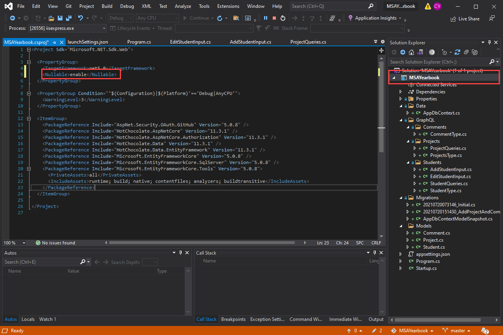

# Implement Mutations

1. Let's create our first mutations for `Students`. The two mutations `AddStudent` and `EditStudent`.

   So inside the folder, `GraphQL/Students` create a new file called `AddStudentInput.cs`. This is where we will be defining the input to create a student. We are using a record which is a short way of defining a basic class.

   ```csharp
   namespace MSAYearbook.GraphQL.Students
   {
       public record AddStudentInput(
           string Name,
           string GitHub,
           string? ImageURI);
   }
   ```

   and create a new file called `EditStudentInput.cs`

   ```csharp
   namespace MSAYearbook.GraphQL.Students
   {
       public record EditStudentInput(
           string StudentId,
           string? Name,
           string? GitHub,
           string? ImageURI);
   }
   ```

   The syntax`?` won't work you need to enable nullable first. Double click on the project `MSAYearbook` and add in the line `<Nullable>enable</Nullable>` After targeted framework.

   

   You'll notice that the`?` means the field is nullable. When we edit a student if the field is null we want to not update the field.

2. With our inputs defined, under `Students` folder let's create a `StudentMutations.cs` file. The file contains the mutations AddStudent and EditStudent which does their job by using the entity framework.

   ```csharp
   using System;
   using System.Threading;
   using System.Threading.Tasks;
   using HotChocolate;
   using HotChocolate.Types;
   using MSAYearbook.Models;
   using MSAYearbook.Data;
   using MSAYearbook.Extensions;

   namespace MSAYearbook.GraphQL.Students
   {
       [ExtendObjectType(name: "Mutation")]
       public class StudentMutations
       {
           [UseAppDbContext]
           public async Task<Student> AddStudentAsync(AddStudentInput input,
           [ScopedService] AppDbContext context, CancellationToken cancellationToken)
           {
               var student = new Student
               {
                   Name = input.Name,
                   GitHub = input.GitHub,
                   ImageURI = input.ImageURI,
               };

               context.Students.Add(student);
               await context.SaveChangesAsync(cancellationToken);

               return student;
           }

           [UseAppDbContext]
           public async Task<Student> EditStudentAsync(EditStudentInput input,
                   [ScopedService] AppDbContext context, CancellationToken cancellationToken)
           {
               var student = await context.Students.FindAsync(int.Parse(input.StudentId));

               student.Name = input.Name ?? student.Name;
               student.GitHub = input.GitHub ?? student.GitHub;
               student.ImageURI = input.ImageURI ?? student.ImageURI;

               context.Students.Add(student);
               await context.SaveChangesAsync(cancellationToken);

               return student;
           }
       }
   }
   ```

3. Register our `StudentMutations` to `Startup.cs`

   ```csharp
   services
   		.AddGraphQLServer()
   		.AddQueryType(d => d.Name("Query"))
   		    .AddTypeExtension<ProjectQueries>()
   		    .AddTypeExtension<StudentQueries>()
   		.AddMutationType(d => d.Name("Mutation"))
   		    .AddTypeExtension<StudentMutations>()
   		.AddType<ProjectType>()
   		.AddType<StudentType>()
   		.AddType<CommentType>();
   ```

4. We can now try write a GraphQL mutation request

   

   ```graphql
   mutation {
     addStudent(input: { name: "", gitHub: "", imageURI: "" }) {
       id
       name
     }
   }
   ```

   We can query the GraphQL to get the new Students we have added

   ```graphql
   query {
     students {
       nodes {
         id
         name
         gitHub
         imageURI
       }
     }
   }
   ```

   

5. Let's add in Mutations for adding and editing Projects and Comments

   In `GraphQL/Projects` add the following:

   - `AddProjectInput.cs`

     ```csharp
     namespace MSAYearbook.GraphQL.Projects
     {
         public record AddProjectInput(
             string Name,
             string Description,
             string Link,
             string Year,
             string StudentId);
     }
     ```

   - `EditProjectInput.cs`

     ```csharp
     namespace MSAYearbook.GraphQL.Projects
     {
         public record EditProjectInput(
             string ProjectId,
             string? Name,
             string? Description,
             string? Link);
     }
     ```

   - `ProjectMutations.cs`

     ```csharp
     using System;
     using System.Threading;
     using System.Threading.Tasks;
     using HotChocolate;
     using HotChocolate.Types;
     using MSAYearbook.Models;
     using MSAYearbook.Data;
     using MSAYearbook.Extensions;
     using MSAYearbook.Extensions;

     namespace MSAYearbook.GraphQL.Projects
     {
         [ExtendObjectType(name: "Mutation")]
         public class ProjectMutations
         {
             [UseAppDbContext]
             public async Task<Project> AddProjectAsync(AddProjectInput input,
                 [ScopedService] AppDbContext context, CancellationToken cancellationToken)
             {
                 var project = new Project
                 {
                     Name = input.Name,
                     Description = input.Description,
                     Link = input.Link,
                     Year = (Year)Enum.Parse(typeof(Year), input.Year),
                     StudentId = int.Parse(input.StudentId),
                     Modified = DateTime.Now,
                     Created = DateTime.Now,
                 };
                 context.Projects.Add(project);

                 await context.SaveChangesAsync(cancellationToken);

                 return project;
             }

             [UseAppDbContext]
             public async Task<Project> EditProjectAsync(EditProjectInput input,
                 [ScopedService] AppDbContext context, CancellationToken cancellationToken)
             {
                 var project = await context.Projects.FindAsync(int.Parse(input.ProjectId));

                 project.Name = input.Name ?? project.Name;
                 project.Description = input.Description ?? project.Description;
                 project.Link = input.Link ?? project.Link;
                 project.Modified = DateTime.Now;

                 context.Projects.Add(project);
                 await context.SaveChangesAsync(cancellationToken);

                 return project;
             }
         }
     }
     ```

   In `GraphQL/Comments` add the following:

   - `AddCommentInput.cs`

     ```csharp
     namespace MSAYearbook.GraphQL.Comments
     {
         public record AddCommentInput(
             string Content,
             string ProjectId,
             string StudentId);
     }
     ```

   - `EditCommentInput.cs`

     ```csharp
     namespace MSAYearbook.GraphQL.Comments
     {
         public record EditCommentInput(
             string CommentId,
             string? Content);
     }
     ```

   - `CommentMutations.cs`

     ```csharp
     using System;
     using System.Threading;
     using System.Threading.Tasks;
     using HotChocolate;
     using HotChocolate.Types;
     using MSAYearbook.Models;
     using MSAYearbook.Data;
     using MSAYearbook.Extensions;

     namespace MSAYearbook.GraphQL.Comments
     {
         [ExtendObjectType(name: "Mutation")]
         public class CommentMutations
         {
             [UseAppDbContext]
             public async Task<Comment> AddCommentAsync(AddCommentInput input,
             [ScopedService] AppDbContext context, CancellationToken cancellationToken)
             {
                 var comment = new Comment
                 {
                     Content = input.Content,
                     ProjectId = int.Parse(input.ProjectId),
                     StudentId = int.Parse(input.StudentId),
                     Modified = DateTime.Now,
                     Created = DateTime.Now,
                 };
                 context.Comments.Add(comment);

                 await context.SaveChangesAsync(cancellationToken);

                 return comment;
             }

             [UseAppDbContext]
             public async Task<Comment> EditCommentAsync(EditCommentInput input,
                     [ScopedService] AppDbContext context, CancellationToken cancellationToken)
             {
                 var comment = await context.Comments.FindAsync(int.Parse(input.CommentId));
                 comment.Content = input.Content ?? comment.Content;
                 context.Comments.Add(comment);

                 await context.SaveChangesAsync(cancellationToken);

                 return comment;
             }
         }
     }
     ```

6. Register our `ProjectMutations` and `CommentMutations` to `Startup.cs`

   ```csharp
   services
   		.AddGraphQLServer()
   		.AddQueryType(d => d.Name("Query"))
   		    .AddTypeExtension<ProjectQueries>()
   		    .AddTypeExtension<StudentQueries>()
   		.AddMutationType(d => d.Name("Mutation"))
   				.AddTypeExtension<StudentMutations>()
   		    .AddTypeExtension<ProjectMutations>()
   				.AddTypeExtension<CommentMutations>()
   		.AddType<ProjectType>()
   		.AddType<StudentType>()
   		.AddType<CommentType>();
   ```

## Summary

In this part, we learned how to mutate data in our database using mutations. In here we cover adding new data and updating existing data. We cover howuit s to define mutation inputs when dealing with different mutations.

[**<< Part #8 - GitHub Oauth & Authorisation >>**](8-setup-github-oauth-and-authorisation.md)
