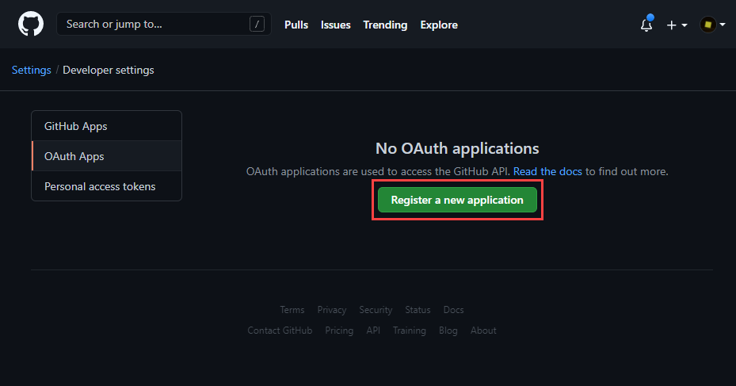

# Advance Feature: GitHub Oauth

1.  Let's add authentication to services in `Startup.cs`

    ```csharp
    var signingKey = new SymmetricSecurityKey(Encoding.UTF8.GetBytes(Configuration["JWT:Secret"]));

    services.AddAuthentication(JwtBearerDefaults.AuthenticationScheme)
        .AddJwtBearer(options =>
        {
            options.TokenValidationParameters =
                new TokenValidationParameters
                {
                    ValidIssuer = "MSA-Yearbook",
                    ValidAudience = "MSA-Student",
                    ValidateIssuerSigningKey = true,
                    IssuerSigningKey = signingKey
                };
        });
    ```

2.  Add `UseAuthentication()` to `Configure`

    ```csharp
    public void Configure(IApplicationBuilder app, IWebHostEnvironment env)
    {
        if (env.IsDevelopment())
        {
            app.UseDeveloperExceptionPage();
        }

        app.UseRouting();

        app.UseAuthentication();

        app.UseEndpoints(endpoints =>
        {
            endpoints.MapGraphQL();
        });
    }
    ```

3.  Let's create an Oauth Application using Github at [https://github.com/settings/developers](https://github.com/settings/developers)

    

    The Homepage URL and Authorization callback URL should be the frontend URL however since they haven't been made just use any temporary URL

    

    

4.  Let's add our client ID and client secrets to `appsettings.Development.json`

    

    We also set JWT secret like above your secret should be a random string that no one knows

5.  Add a new mutation called Login in `GraphQL/Students`

    Let's create the input and payload

    Add a new class called `LoginInput.cs` in `GraphQL/Students`

    ```csharp
    namespace MSAYearbook.GraphQL.Students
    {
        public record LoginInput(
            string Code);
    }
    ```

    Add a new class called `LoginPayload.cs` in `GraphQL/Students`

    ```csharp
    using MSAYearbook.Models;

    namespace MSAYearbook.GraphQL.Students
    {
        public record LoginPayload(
            Student student,
            string jwt);
    }
    ```

    In `StudentMutations.cs` in `GraphQL/Students` add the following new method

    ```csharp
    [UseAppDbContext]
    public async Task<LoginPayload> LoginAsync(LoginInput input, [ScopedService] AppDbContext context, CancellationToken cancellationToken)
    {

    }
    ```

6.  Add the following Login method to verify the code in OAuth

    ```csharp
    var client = new GitHubClient(new ProductHeaderValue("MSA-Yearbook"));

    var request = new OauthTokenRequest(Startup.Configuration["Github:ClientId"], Startup.Configuration["Github:ClientSecret"], input.code);
    var tokenInfo = await client.Oauth.CreateAccessToken(request);

    if (tokenInfo.AccessToken == null) {
        throw new GraphQLRequestException(ErrorBuilder.New()
            .SetMessage("Bad code")
            .SetCode("AUTH_NOT_AUTHENTICATED")
            .Build());
    }
    ```

7.  Now we have the AccessToken which is fetched using OAuth and the code.

    We can use AccessToken to get the current User

    ```csharp
    client.Credentials = new Credentials(tokenInfo.AccessToken);
    var user = await client.User.Current();
    ```

8.  Now, let's check if the student already exist in our database, If not let's create a new student

    ```csharp
    if (student == null)
    {
        student = new Student {
            Name = user.Name ?? user.Login,
            GitHub = user.Login,
            ImageURI = user.AvatarUrl,
        };

        context.Students.Add(student);
        await context.SaveChangesAsync(cancellationToken);
    }
    ```

9.  Using the student, let us create a new JWT token and return it as a payload

    ```csharp
    // authentication successful so generate jwt token
    var signingKey = new SymmetricSecurityKey(Encoding.UTF8.GetBytes(Startup.Configuration["JWT:Secret"]));
    var credentials = new SigningCredentials(signingKey, SecurityAlgorithms.HmacSha256);

    var claims = new List<Claim>{
        new Claim(ClaimTypes.NameIdentifier, student.Id.ToString()),
    };

    var jwtToken = new JwtSecurityToken(
        "MSA-Yearbook",
        "MSA-Student",
        claims,
        expires: DateTime.Now.AddDays(90),
        signingCredentials: credentials);

    string token = new JwtSecurityTokenHandler().WriteToken(jwtToken);

    return new LoginPayload(student, token);
    ```

10. Time to test our Login mutation. First log in with GitHub OAuth to create a new code.

    Open up the following link using your clientId

    ```csharp
    https://github.com/login/oauth/authorize?client_id={clientId}
    ```

    example: [https://github.com/login/oauth/authorize?client_id=a6ac879139cfdf60af2a](https://github.com/login/oauth/authorize?client_id=a6ac879139cfdf60af2a)

    Once Logged in, you would be redirected to a temporary link you defined

    

    The code is located in the URL params `code`

    Call the following and replace CODE with the code from the URL

    ```csharp
    mutation {
      login(input: {code: "CODE"}) {
        jwt
      }
    }
    ```

    

    Check out [https://jwt.io/](https://jwt.io/) and use the Debugger to view the JWT decoded (base64)

    

11. Now let us add authorisation to an endpoint called `self`

    In `StudentQueries.cs` in `GraphQL/Students`

    ```csharp
    [UseAppDbContext]
    [Authorize]
    public Student GetSelf(ClaimsPrincipal claimsPrincipal, [ScopedService] AppDbContext context)
    {
        var studentIdStr = claimsPrincipal.Claims.First(c => c.Type == "studentId").Value;

        return context.Students.Find(int.Parse(studentIdStr));
    }
    ```

    to enable the `[Authorize]` we have to add the following to `Startup.cs`

    ```csharp
    services.AddAuthentication(...);

    services.AddAuthorization();

    services
        .AddGraphQLServer()
        .AddAuthorization()
            ...
    ```

    We can try to call this using the following (make sure you set the bearer token)

    

    The self request allows the user to request details of themself after they log in!

    

12. Let's update the old mutations to use the new authorisation settings. Example:

    `ProjectMutations.cs`

    ```csharp
    using System;
    using System.Linq;
    using System.Threading;
    using System.Threading.Tasks;
    using System.Security.Claims;
    using HotChocolate;
    using HotChocolate.Types;
    using HotChocolate.AspNetCore;
    using HotChocolate.AspNetCore.Authorization;
    using MSAYearbook.Models;
    using MSAYearbook.Data;
    using MSAYearbook.Extensions;

    namespace MSAYearbook.GraphQL.Projects
    {
        [ExtendObjectType(name: "Mutation")]
        public class ProjectMutations
        {
            [UseAppDbContext]
            [Authorize]
            public async Task<Project> AddProjectAsync(AddProjectInput input, ClaimsPrincipal claimsPrincipal,
                [ScopedService] AppDbContext context, CancellationToken cancellationToken)
            {
                var studentIdStr = claimsPrincipal.Claims.First(c => c.Type == "studentId").Value;
                var project = new Project
                {
                    Name = input.Name,
                    Description = input.Description,
                    Link = input.Link,
                    Year = (Year)Enum.Parse(typeof(Year), input.Year),
                    StudentId = int.Parse(studentIdStr),
                    Modified = DateTime.Now,
                    Created = DateTime.Now,
                };
                context.Projects.Add(project);

                await context.SaveChangesAsync(cancellationToken);

                return project;
            }

            [UseAppDbContext]
            [Authorize]
            public async Task<Project> EditProjectAsync(EditProjectInput input, ClaimsPrincipal claimsPrincipal,
                [ScopedService] AppDbContext context, CancellationToken cancellationToken)
            {
                var studentIdStr = claimsPrincipal.Claims.First(c => c.Type == "studentId").Value;
                var project = await context.Projects.FindAsync(int.Parse(input.ProjectId));

                if (project.StudentId != int.Parse(studentIdStr))
                {
                    throw new GraphQLRequestException(ErrorBuilder.New()
                        .SetMessage("Not owned by student")
                        .SetCode("AUTH_NOT_AUTHORIZED")
                        .Build());
                }

                project.Name = input.Name ?? project.Name;
                project.Description = input.Description ?? project.Description;
                project.Link = input.Link ?? project.Link;
                project.Modified = DateTime.Now;

                await context.SaveChangesAsync(cancellationToken);

                return project;
            }
        }
    }
    ```

    Remember to remove `StudentId` from inputs in `AddProjectInput.cs`. example:

    ```csharp
    namespace MSAYearbook.GraphQL.Projects
    {
        public record AddProjectInput(
            string Name,
            string Description,
            string Link,
            string Year);
    }
    ```

    `CommentMutations`

    ```csharp
    using System;
    using System.Linq;
    using System.Threading;
    using System.Threading.Tasks;
    using System.Security.Claims;
    using HotChocolate;
    using HotChocolate.Types;
    using HotChocolate.AspNetCore;
    using HotChocolate.AspNetCore.Authorization;
    using MSAYearbook.Models;
    using MSAYearbook.Data;
    using MSAYearbook.Extensions;

    namespace MSAYearbook.GraphQL.Comments
    {
        [ExtendObjectType(name: "Mutation")]
        public class CommentMutations
        {
            [UseAppDbContext]
            [Authorize]
            public async Task<Comment> AddCommentAsync(AddCommentInput input, ClaimsPrincipal claimsPrincipal,
            [ScopedService] AppDbContext context, CancellationToken cancellationToken)
            {
                var studentIdStr = claimsPrincipal.Claims.First(c => c.Type == "studentId").Value;
                var comment = new Comment
                {
                    Content = input.Content,
                    ProjectId = int.Parse(input.ProjectId),
                    StudentId = int.Parse(studentIdStr),
                    Modified = DateTime.Now,
                    Created = DateTime.Now,
                };
                context.Comments.Add(comment);

                await context.SaveChangesAsync(cancellationToken);

                return comment;
            }

            [UseAppDbContext]
            [Authorize]
            public async Task<Comment> EditCommentAsync(EditCommentInput input, ClaimsPrincipal claimsPrincipal,
                    [ScopedService] AppDbContext context, CancellationToken cancellationToken)
            {
                var studentIdStr = claimsPrincipal.Claims.First(c => c.Type == "studentId").Value;
                var comment = await context.Comments.FindAsync(int.Parse(input.CommentId));

                if (comment.StudentId != int.Parse(studentIdStr))
                {
                    throw new GraphQLRequestException(ErrorBuilder.New()
                        .SetMessage("Not owned by student")
                        .SetCode("AUTH_NOT_AUTHORIZED")
                        .Build());
                }

                comment.Content = input.Content ?? comment.Content;

                await context.SaveChangesAsync(cancellationToken);

                return comment;
            }
        }
    }
    ```

    remember to remove `StudentId` from inputs in `AddCommentInput.cs` too:

    ```csharp
    namespace MSAYearbook.GraphQL.Comments
    {
        public record AddCommentInput(
            string Content,
            string ProjectId);
    }
    ```

    `StudentMutations.cs`, remove `AddStudent` and `AddStudentInput.cs` . Edit the following:

    ```csharp
    [UseAppDbContext]
    [Authorize]
    public async Task<Student> EditStudentAsync(EditStudentInput input, ClaimsPrincipal claimsPrincipal,
            [ScopedService] AppDbContext context, CancellationToken cancellationToken)
    {
        var studentIdStr = claimsPrincipal.Claims.First(c => c.Type == "studentId").Value;
        var student = await context.Students.FindAsync(int.Parse(studentIdStr), cancellationToken);

        student.Name = input.Name ?? student.Name;
        student.ImageURI = input.ImageURI ?? student.ImageURI;

        await context.SaveChangesAsync(cancellationToken);

        return student;
    }
    ```

### Congratulations you just finished the backend!

There is still plently of advance features you should challenge!

We recommend trying to add Dataloaders first. Contact us if you need help 🍻

- https://chillicream.com/docs/hotchocolate/fetching-data/dataloader/
- https://www.learmoreseekmore.com/2021/01/hotchocolate-graphql-query-dataloader.html

[😁 Like my work? Hit the follow button!](https://github.com/scorpionknifes)
⭐ This repo above!
