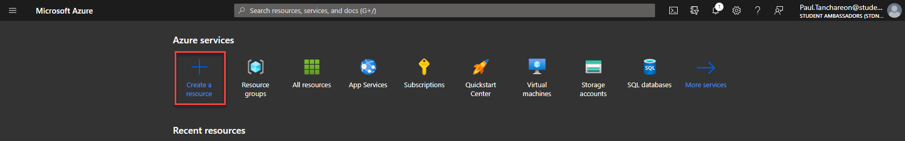
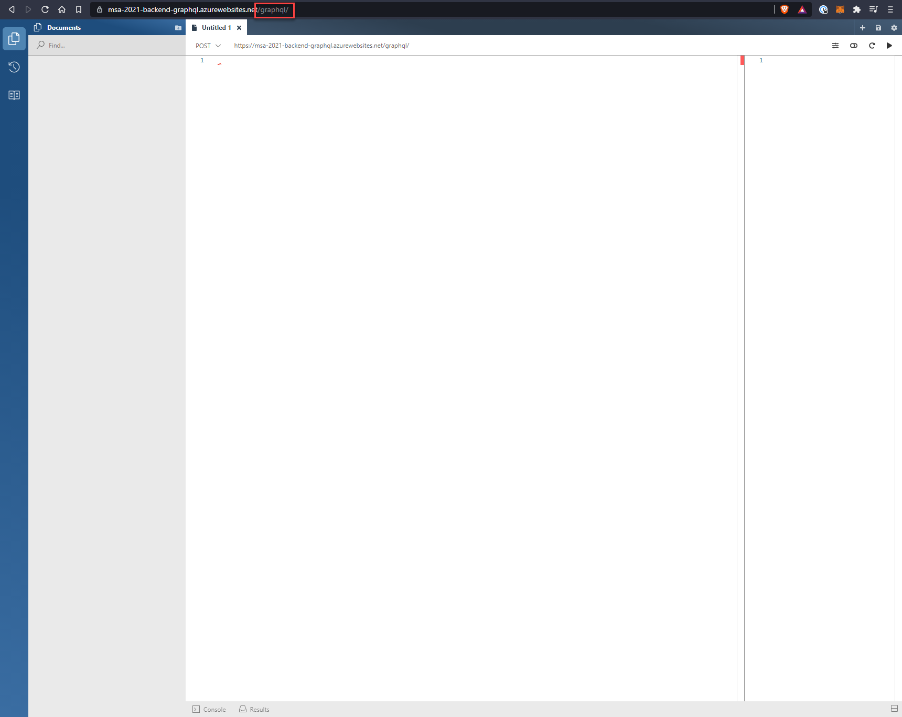

# CI/CD pipeline with GitHub Action and Azure

## Introduction

Now that you've experienced the process of developing an application. What if you're ready to publish your app so everyone on the internet could use?

Do you run it locally on your computer and re-build it everytime you make changes?

_Probably not_, as that would cause multiple outages for end users. And your service would be inaccessible as soon as you powerdown your PC.

Now, imagine a large enterprise software with complex deployment process. Manually re-building the source code, copying the build to the production server everytime your team make changes becomes very inefficient and error-prone. 🤯

We need a better solution! 🤔

## What is DevOps?

_"A set of practices that automate and integrate processes so teams can build, test, and release software faster and more reliably._

- **For organization** DevOps provides value by increasing overall quality and stability of the application, shorten time to production, and allow for more frequent releases.
- **For developers** DevOps is about putting automation in place for reptitive tasks such as deployment, testing and auditing so they can focus more efforts on writing quality code changes.

At the heart of DevOps is CI/CD or _continuous integration & continuous deployment._

- **Continous Integration**: A practice where we implements, check-in small code changes and test them frequently, allowing us to catch any issues as early as possible (so bugs don't slip into production 😱).
- **Continous Deployment**: Automatically release code into various environments through a robust pipeline, keeping our application deployable at any given point.

In this section, you'll learn how to implements a CI/CD pipeline using GitHub Actions to automatically build and deploy your code to Azure app service.

> **GitHub Actions**: GitHub integrated CI/CD solution to helps automate tasks such as build & deployment.

> **Azure App Service:** Allows you to quickly build, deploy, and scale enterprise-grade web, mobile, and API apps running on any platform. A platform as a service (PaaS) environment with underlying infrastructure managed by Microsoft.

# Prerequisites

- A repository on GitHub
- An Azure account

[You can signup to Azure for students here](https://azure.microsoft.com/en-us/free/students/starter/)

[Learn more about Azure account here](https://docs.microsoft.com/en-us/learn/modules/create-an-azure-account/)

## Creating a `feature/github-action` branch

1.  As with adding any new features we should develop and test new changes on a separated branch first, create a new branch `feature/github-action`.
2.  `git clone` your repository to a local directory, and create a new branch using:

```
git checkout -b feature/github-actions
```

3. And push your branch to GitHub remote repository.

```
git push --set-upstream origin feature/github-actions
```

## Creating Azure App Service

1. Login to your [Azure portal](https://portal.azure.com/) and click on `Create a resource`.



2. Select `Web App` and fill out the configuration details. If you don't have a resource group - Click on `Create new`. This allows you to group all project resources on Azure together.
   - Select the correct runtime stack for your backend. e.g. `.NET 5`
   - Make sure for `Sky and size` - you select a free tier for development. Otherwise this could unneccessary burns through your available credit! 💸


3. Proceed `Next: Deployment (Preview)`. Enable the GitHub Actions deployment.
   - Select your backend repository and branch - `feature/github-actions`.

GitHub Actions uses a configurable workflow `yml` file to describes how the CI/CD should be executed.

You can click on `Preview file` to see the workflow.

Copmpleting this setup will commit this workflow file to our `feature/github-actions` branch we selected.


4. Hit `Review + Create` and in the confirmation screen confirm the creation of the Web app.

5. Once deployment is complete, headover to your resource, you should now see the URL of your web application.


6. Setup Application Settings from the backend (only if you git ignored `appsettings.Development.json`)
   

7. Don't forget to add `/graphql` at the end of your URL to access the GraphQL playground. Great! Your backend is now live and publicly accessible on the internet. 🌐



Congratulation! You've successfully deployed your GraphQL backend service to Azure. 🎉

## Examining GitHub Actions Workflow

1. Head over to your GitHub repository. You'll notice that latest commit on `feature/github-actions` branch, Azure added a yml file which resides in the `.github/workflows` folder.

   This workflow is used by GitHub Actions to build and deploy our source code to Azure App Service.

   Headover to `Actions` tab. Here we can see the initial first run of our CI/CD pipeline on `feature/github-actions` that happens when we configured the Web app service on Azure which build & deploy our backend.


2. Examining the GitHub Actions workflow we see the following.

   - Trigger on `feature/github-actions` branch - When there's new changes on this branch, the workflow will build & deploy source code to Azure.
   - Steps that runs `donet build` & `dotnet publish` command against our source code.
   - GitHub is able to deploy to Azure using deployment profile stored under **Settings -> Secrets** on GitHub (secret variable).

```yml
# Docs for the Azure Web Apps Deploy action: https://go.microsoft.com/fwlink/?linkid=2134798
# More GitHub Actions for Azure: https://go.microsoft.com/fwlink/?linkid=2135048

name: Azure App Service - msa-2021-backend-graphql(Production), Build and deploy DotnetCore app

on:
  push:
    branches:
      - feature/github-actions

jobs:
  build-and-deploy:
    runs-on: windows-latest

    steps:
      # checkout the repo
      - name: "Checkout Github Action"
        uses: actions/checkout@master

      - name: Set up .NET Core
        uses: actions/setup-dotnet@v1
        with:
          dotnet-version: "5.0.x"

      - name: Build with dotnet
        run: dotnet build --configuration Release

      - name: dotnet publish
        run: dotnet publish -c Release -o ${{env.DOTNET_ROOT}}/myapp

      - name: Run Azure webapp deploy action using publish profile credentials
        uses: azure/webapps-deploy@v2
        with:
          app-name: msa-2021-backend-graphql
          slot-name: Production
          publish-profile: ${{ secrets.AZUREAPPSERVICE_PUBLISHPROFILE_0000000000000000000000 }}
          package: ${{env.DOTNET_ROOT}}/myapp
```

⚠ **Notes**: If your workflow fails, `MSBUILD : error MSB1003: Specify a project or solution file. The current working directory does not contain a project or solution file.` You might not have the solution file at the root of the repo (e.g. under nested sub-folder).

If that's the case, add the following options to specify `working-directory` e.g. if you have your backend inside `Backend` folder.

```yml

---
jobs:
  build-and-deploy:
    runs-on: windows-latest
    defaults:
      run:
        working-directory: "./Backend"
```

3. Update the workflow name to `Build & Deploy GraphQL Backend` for simplicity, add `main` to branch and remove `feature/github-actions`. This will allows us to automatically re-deploy our application to Azure upon completing pull request to merge to `main`.

Run `git pull` in your local repo to pull the latest commits. Make the following changes to yml file and commit to `feature/github-actions`.

```yml
# Docs for the Azure Web Apps Deploy action: https://go.microsoft.com/fwlink/?linkid=2134798
# More GitHub Actions for Azure: https://go.microsoft.com/fwlink/?linkid=2135048

name: Build & Deploy GraphQL Backend

on:
  push:
    branches:
      - main

jobs:
  build-and-deploy:
    runs-on: windows-latest

    steps:
      # checkout the repo
      - name: "Checkout Github Action"
        uses: actions/checkout@master

      - name: Set up .NET Core
        uses: actions/setup-dotnet@v1
        with:
          dotnet-version: "5.0.x"

      - name: Build with dotnet
        run: dotnet build --configuration Release

      - name: dotnet publish
        run: dotnet publish -c Release -o ${{env.DOTNET_ROOT}}/myapp

      - name: Run Azure webapp deploy action using publish profile credentials
        uses: azure/webapps-deploy@v2
        with:
          app-name: msa-2021-backend-graphql
          slot-name: Production
          publish-profile: ${{ secrets.AZUREAPPSERVICE_PUBLISHPROFILE_0000000000000000000000 }}
          package: ${{env.DOTNET_ROOT}}/myapp
```

4. Since, we've added a CI/CD trigger on `main` branch and our feature development is complete. Let's create a pull request to merge our `feature/github-action` to `main`.


1. Since, code in `main` branch is production ready. Here back in `Actions` tab. We can really see the power of CI/CD as it automatically kicks off to re-deploy our latest changes to production!


## Summary

You've learnt how to quickly setup CI/CD pipeline for your backend application using **GitHub action** and **Azure Web app service**. CI/CD becomes extremely important as your application complexity grew.

GitHub workflow ensures that deployment process is self-documented along side your code. This has tremendous benefit as any chances made to the pipeline will be tracked by git commits ensuring that if you rollback to the specific commits, the previous workflow will also be restored correctly.

CI/CD also helps reduce human error that could be introduced in manual deployment. And if something goes wrong with the CI/CD, it's an indication that likely it was the latest change you introduce to the repository allowing you to adjust the pipeline as neccessary.
