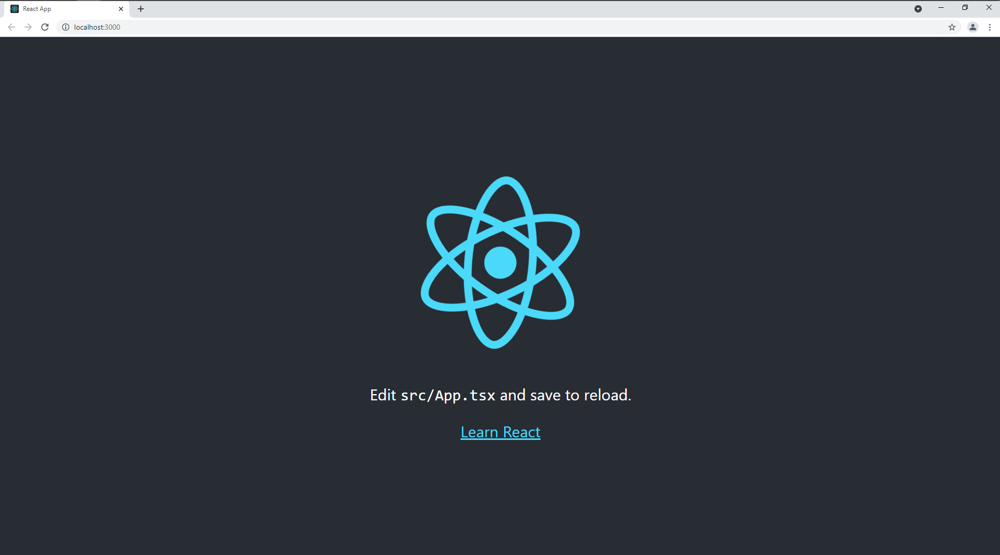

# Microsoft Student Accelerator 2021 Phase 2 Training - General Stream
The official repository and source of knowledge for MSA students taking part in MSA 2021 Phase 2 Training. 

# Assignment
[General Software Stream](2021-MSA-Phase2-General-Stream.pdf)

# Software Needed
- [Visual Studio Community 2019](https://visualstudio.microsoft.com/downloads/)
    - When installing ensure [ASP.NET](http://asp.net/) and web development is selected
- [Azure Account - Free for students](https://azure.microsoft.com/en-us/free/students/)
- [GitHub Account](https://github.com/join)
- [GIT SCM](https://git-scm.com/downloads)
- [.NET Core 5.0 SDK](https://dotnet.microsoft.com/download/dotnet/5.0)
- [Visual Studio Code](https://code.visualstudio.com/download)
- [NPM](https://www.npmjs.com/get-npm)
- [NodeJS](https://nodejs.org/en/download/)
    - be able to run the following commands in command line (run as Administrator):
        ``` 
        npx create-react-app my-app --template typescript
        cd my-app
        npm start 
        ```
        You should see the following page open in your web browser after the last command (npm start):
        


## Microsoft Azure Subscription

All students should have this from Basic Training, to check, visit the [Microsoft Azure Portal](http://portal.azure.com) and check the Subscriptions tab to ensure you have "Dreamspark"/"Imagine"/"Azure for Students" subscription listed.

If you don't, then visit [Microsoft Azure](https://azure.microsoft.com/en-us/free/students/) to register yourself as a student, verify and activate Azure through the links on the site.

# [Why React + Typescript?](https://blog.logrocket.com/how-why-a-guide-to-using-typescript-with-react-fffb76c61614)

TypeScript is a free, open-source programming language developed and maintained by Microsoft. It is a strict superset of JavaScript and adds optional static typing and class-based object-oriented programming to the language.

Other useful NodeJS Links:

* [Node JS installation](https://nodejs.org/en/)
* [NPM installation](https://www.npmjs.com/)
* [Basics of React](https://reactjs.org/docs/hello-world.html)

# [API's?](https://www-01.ibm.com/common/ssi/cgi-bin/ssialias?htmlfid=WSM14025USEN)

Application Programming Interfaces (APIs) are the underpinning of the cloud, mobile, and Internet of Things (IoT) revolution. The speed, ease, and portability of data exchanged through APIs allow for all our modern innovations and conveniences. Everything from how we order taxis, move money between bank accounts, watch entertainment, share life moments through videos on our social media feeds, and manage or monitor our homes . . . it all happens because of APIs. APIs are connecting the world in ways that were previously unfathomable.

## Stuck? 
Post your question on our [facebook group](https://aka.ms/nzmsa) or on our [discord server](https://discord.gg/c4Y5SAZ)

### Want to contribute? 
We welcome all students to help us improve documentation for other students. If you find a typo or find something is unclear, please open a pull request or an issue
